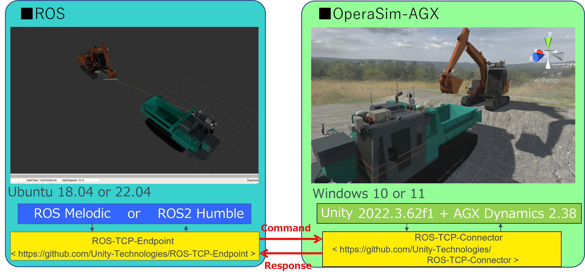

インストール方法
=================

.. note::

   本ページの内容は、OperaSim-AGX リポジトリの ``main`` ブランチの状態を前提としています。
   Unity / AGX Dynamics のバージョン等は、今後の更新に応じて適宜読み替えてください。

1. Unity と AGX Dynamics のインストール
----------------------------------------

.. warning::

   OperaSim-AGX を実行するには、Unity 本体に加えて **AGX Dynamics のライセンス** が必須です。

- Unity Hub をインストールする

  - Windows / macOS の場合:
    https://unity3d.com/jp/get-unity/download
  - Linux の場合:
    https://unity3d.com/get-unity/download

    (Linux 版での動作確認は現時点では十分には行っていません)

- Unity Hub から、次のバージョンの Unity Editor をインストールする

  - Unity 2022.3.62f1

- AGX Dynamics をインストールし、ライセンスファイルを取得する

  - 例: AGX 2.38.0.1 (x64 VS2022)
  - 利用するモジュール:

    - AGX Dynamics Core
    - AGX Dynamics Terrain
    - AGX Dynamics Granular
    - AGX Dynamics Tracks

  - インストール方法やライセンスの取得方法は `AGX Dynamics のマニュアル <https://www.algoryx.se/documentation/complete/agx/tags/latest/doc/UserManual/source/legal_notice.html>`_ に従ってください。

2. OperaSim-AGX プロジェクトの取得と Unity Editor の起動
----------------------------------------------------------

1. GitHub から OperaSim-AGX を取得する

   .. code-block:: console

      $ cd (作業ディレクトリ)
      $ git clone https://github.com/pwri-opera/OperaSim-AGX.git

   あるいは GitHub の画面から ZIP をダウンロードして展開しても構いません。

2. Unity Hub を起動し、画面右上の「追加」ボタンから
   クローン／展開した ``OperaSim-AGX`` フォルダを選択する。

   - 初回起動時には Unity Editor のインストールやライブラリの生成のため、
     数分程度かかる場合があります。
   - 指定の Unity Editor (2022.3.62f1) がインストールされていない場合は、
     このタイミングで自動的にインストールを促されます。

3. 「OperaSim-AGX」プロジェクトを Unity Hub のリストから選択し、
   Unity Editor を起動する。

.. .. image:: https://user-images.githubusercontent.com/82022162/159667401-9f5f0393-3e23-4178-98b4-90408fa83305.jpg

.. .. image:: https://user-images.githubusercontent.com/82022162/159667974-c66c51f0-c067-4c7b-a434-2eecf9e2051d.jpg
3. Scene ファイルの選択
------------------------

Unity Editor 起動後、シーンに建設機械モデルが表示されていない場合は、
プロジェクトウィンドウから ``Assets/Scenes/MainScene.unity`` をダブルクリックしてロードします。

.. image:: https://user-images.githubusercontent.com/82022162/159667970-b24fbc10-f4e8-4acf-8290-d6a541fd2efc.jpg

4. AGX Dynamics ライセンスファイルの配置
-----------------------------------------

AGX Dynamics のインストール時に取得したライセンスファイル
(通常は ``.lic`` 拡張子) を Unity プロジェクト内の所定の場所にコピーします。

- コピー先の例:

  - ``Assets/AGXUnity/Plugins/x86_64``

.. image:: https://user-images.githubusercontent.com/82022162/159667980-0426a5a0-f920-4a50-99b3-0b70ddc442c2.jpg

Unity Editor を再起動し、AGX Unity のインスペクタ等で
ライセンスが認識されていることを確認してください。

5. ROS-TCP-Connector の設定
---------------------------

OperaSim-AGX と ROS (ROS 1 / ROS 2) の通信には
`ROS-TCP-Connector <https://github.com/Unity-Technologies/ROS-TCP-Connector>`_ を使用します。

Unity プロジェクトを初めて開いた際に必要なパッケージが自動的に追加されない場合は、
Package Manager から手動で追加してください。

- 使用する主なパッケージ (参考)

  - `AGXUnity`_: 5.0.1
  - `ROS-TCP-Connector`_: 0.7.0
  - `URDF-Importer`_: 0.5.2
  - `UnitySensors`_: 開発版

.. _AGXUnity: https://github.com/Algoryx/AGXUnity
.. _ROS-TCP-Connector: https://github.com/Unity-Technologies/ROS-TCP-Connector
.. _URDF-Importer: https://github.com/Unity-Technologies/URDF-Importer
.. _UnitySensors: https://github.com/algoryx/AGXUnitySensorSamples  # 適宜修正

ROS 側との接続設定は、Unity Editor 上部のメニューから行います。

1. メニューバーから :menuselection:`Robotics --> ROS Setting` を開く。
2. ``ROS IP Address`` と ``ROS Port`` に、ROS 側 PC の IP アドレスおよびポート番号を設定する。
   - デフォルトのポート番号は ``10000`` です。
3. ROS 2 を利用する場合は、``Protocol`` を ``ROS1`` から ``ROS2`` に変更する。

.. image:: https://user-images.githubusercontent.com/24404939/159395478-46617a2f-b05c-4227-9fc9-d93712dc4b9f.jpg
   :alt: ROS Setting の画面イメージ

6. ROS-TCP-Endpoint のセットアップ
-----------------------------------

ROS 側では、Unity と通信するために
`ROS-TCP-Endpoint <https://github.com/Unity-Technologies/ROS-TCP-Endpoint>`_ をセットアップします。
初回のみ、以下の手順でパッケージをクローン・ビルドしてください。

ROS 1 の場合
^^^^^^^^^^^^

.. code-block:: console

   $ cd (rosワークスペース)/src
   $ git clone https://github.com/Unity-Technologies/ROS-TCP-Endpoint.git
   $ cd ./ROS-TCP-Endpoint/
   $ sudo chmod +x setup.py
   $ ./setup.py
   $ catkin build ros_tcp_endpoint
   $ source ../../devel/setup.bash

ROS 2 の場合
^^^^^^^^^^^^

.. code-block:: console

   $ cd (ros2ワークスペース)/src
   $ git clone -b main-ros2 https://github.com/Unity-Technologies/ROS-TCP-Endpoint.git
   $ cd ./ROS-TCP-Endpoint/
   $ sudo chmod +x setup.py
   $ ./setup.py
   $ cd ../../
   $ colcon build --packages-select ros_tcp_endpoint
   $ . install/setup.bash

7. ROS との連携の起動例
------------------------

1. ROS 側で通信エンドポイントを起動します。

   ROS 1 の場合:

   .. code-block:: console

      $ roslaunch ros_tcp_endpoint endpoint.launch

   ROS 2 の場合:

   .. code-block:: console

      $ ros2 launch ros_tcp_endpoint endpoint.launch

   (必要に応じて ``--ros-args -p ROS_IP:=<your IP>`` 等の引数を指定してください)

2. Unity Editor で Play ボタンを押し、シミュレーションを開始します。

   .. image:: https://user-images.githubusercontent.com/24404939/159396113-993ff0b2-d2bb-4567-ac68-0eafc9f524ac.png
      :alt: Unity Editor の再生ボタン

3. 建設機械モデルに対応する ROS 2 パッケージ側の Unity 連携用 launch を起動します。

   例: 油圧ショベル ZX120 (``zx120_ros2``) の場合

   .. code-block:: console

      $ ros2 launch zx120_unity zx120_standby.launch.py

   例: クローラダンプ IC120 (``ic120_ros2``) の場合

   .. code-block:: console

      $ ros2 launch ic120_unity ic120_standby_ekf.launch.py

上記が正常に動作していれば、OperaSim-AGX 上の建設機械と ROS 側ノード群との間で
トピック通信が行われ、コマンド送信・状態取得が可能になります。
