モデル（油圧ショベル・クローラダンプ）の概要・構成
==================================================

このチャプターで油圧ショベル、クローラダンプのモデル構成について説明する。最終的なモデルはPrefabファイルとして保存されており、MainSceneで使用される：

**油圧ショベル：**\ Assets/Excavator/Prefabs/Excavator_zx135u.prefab

**クローラダンプ：**\ Assets/DumpTruck/Prefabs/DumpTruck_ic120.prefab

URDFファイルからの取込み
----------------------------

AGX UnityのURDF Importerを使用し、油圧ショベル、クローラダンプのURDFモデルをUnityにインポートした。
URDFモデルはプロジェクトファイルに保存されている。

+-------------+---------------------------+---------------------------+
|             | **油圧ショベル**          | **クローラダンプ**        |
+=============+===========================+===========================+
| 元々のURDF  | Asset                     | Asset                     |
|             | s/Excavator/URDF/original | s/DumpTruck/URDF/original |
+-------------+---------------------------+---------------------------+
| 修          | As                        | As                        |
| 正したURDF  | sets/Excavator/URDF/fixed | sets/DumpTruck/URDF/fixed |
+-------------+---------------------------+---------------------------+

修正したURDFモデルは、剛体と関節の構成が含まれる。コリジョンモデルやTracks等はUnityにインポート後、Unity
Editorから追加した。合わせて、不要な剛体を削除した。

モデル概要（コリジョンモデル、ビジュアルモデル）
------------------------------------------------

コリジョンモデルは、Primitive形状（ボックスと円筒）を使用し、Unity
Editorから追加した。MainSceneの\ **AGXUnity.Rendering.DebugRenderManager**\ を有効化するとコリジョンモデルを確認することができる。

*油圧ショベルのビジュアルモデル*

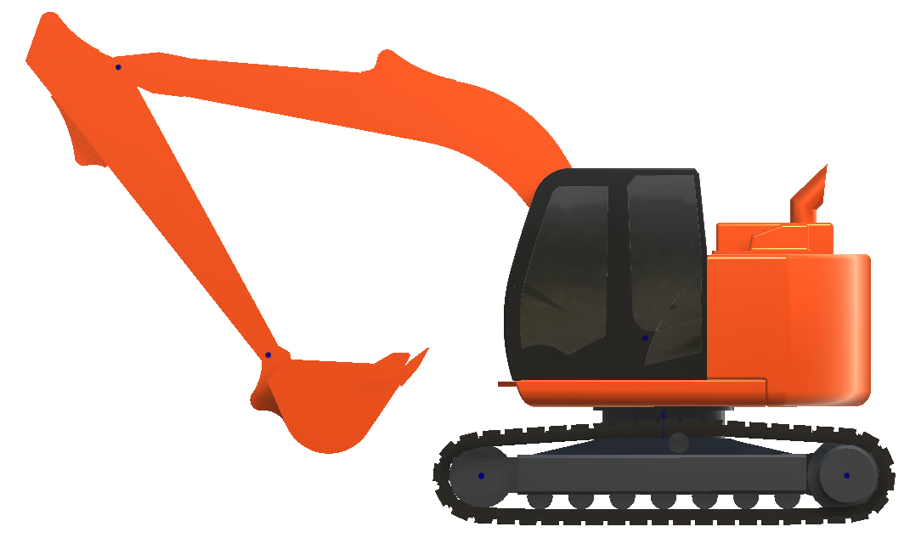

*油圧ショベルのコリジョンモデル*

*クローラダンプのビジュアルモデル*

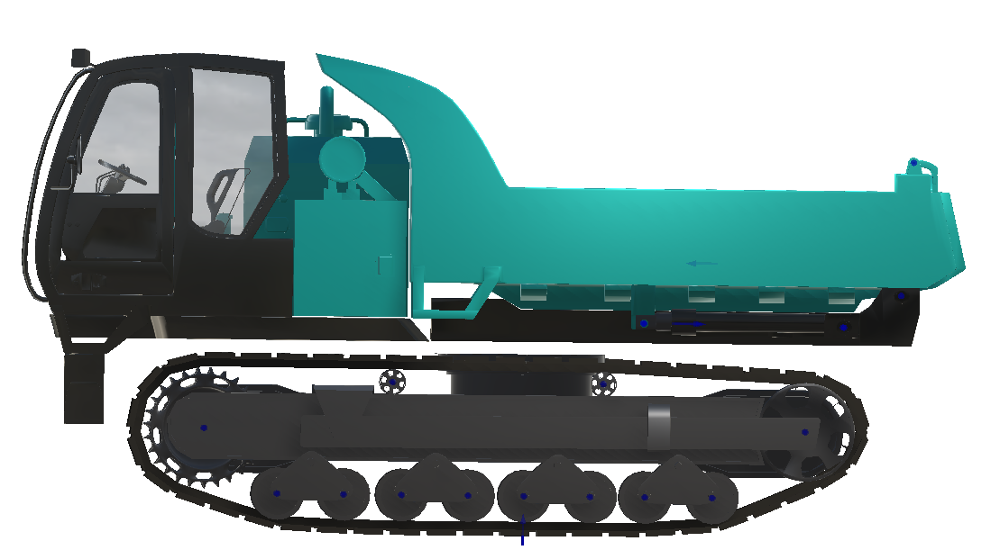

*クローラダンプのコリジョンモデル*

動作方法
--------

モデルを動かすには、AGX
DynamicsのHinge関節のLockControllerまたはTargetSpeedControllerを使用して指令値を設定する。制御するHinge関節は以降の通り。

+----------------------------------+-----------------------------------+
| **油圧ショベル**                 | **クローラダンプ**                |
+==================================+===================================+
| sprocket_L_joint                 | sprocket_L_joint                  |
+----------------------------------+-----------------------------------+
| sprocket_R_joint                 | sprocket_R_joint                  |
+----------------------------------+-----------------------------------+
| upper_joint                      | container_joint                   |
+----------------------------------+-----------------------------------+
| boom_joint                       |                                   |
+----------------------------------+-----------------------------------+
| arm_joint                        |                                   |
+----------------------------------+-----------------------------------+
| backet_joint                     |                                   |
+----------------------------------+-----------------------------------+

それぞれの建機のルートオブジェクトにROSからのデータ通信を扱うクラス（Excavator/DumpTruck
Subsriber）とUnity内でキーボード・ゲームパッドでの操作を扱うクラス（Excavator/DumpTruck
Player Input
Handler）の制御インタフェースを用意した。これにより他の制御システムを容易に変更できる。

以下の図の通り、Excavator_zx135u のPrefabのルートに\ **Excavator.cs**
ComponentとDumpTruck_ic120のPrefabのルートに\ **DumpTruck.cs**
Componentが用意されており、制御指令が各関節に伝達される。

Excavator ComponentとDumpTruck Componentは、Constraint
Controlオブジェクトを経由して、各関節への指令値の設定や、制御種類を替えるインテリジェンスを提供している。以下の画像で、InspectorからExcavator_zx135uのExcavator
Componentのバケット用のConstraint Controlを確認できる。

Play時にExcavator/Dump Truck Subscriberは受けた指令値でControl
Valueを更新する。

以下の３つの制御方式（Control Type）がある。

+--------------------+-------------------------------------------------+
| **Control Type**   | **設定方法**                                    |
+====================+=================================================+
| Pos                | LockControllerのsetPositionメソッド             |
| ition（位置、角度) |                                                 |
+--------------------+-------------------------------------------------+
| Sp                 | TargetSpeedControllerのsetSpeedメソッド         |
| eed（速度、角速度) |                                                 |
+--------------------+-------------------------------------------------+
| Force（力、トルク) | TargetSpeedControllerのsetForceRangeメソッド    |
|                    |                                                 |
|                    | （setSpeedは無限に設定）                        |
+--------------------+-------------------------------------------------+

本プロジェクト用の特別なモデル設定
----------------------------------

履帯（Tracks）について
~~~~~~~~~~~~~~~~~~~~~~

シミュレーションには、URDFモデルに入った履帯モデルではなく、AGXUnityが提供するTrack
Componentを使ったシミュレーション用の履帯を生成し使用する。

手順は、Track Wheel ComponentでWheelの設定を行い、Track
Componentによって実際の履帯生成を行う。Track
Rendererによって履帯のビジュアルを設定し、Trackのコンタクトマテリアル設定によってTerrainと履帯の接触について定義を行う。

以下で、それぞれの設定方法を説明する。

Track Wheel Component
^^^^^^^^^^^^^^^^^^^^^

Track Wheel ComponentをGameObjectに追加することでWheelを定義する。

Track Wheel
Componentから自動的に履帯のルートが計算されるため（次項で説明するTrack
Componentが計算を行う）、履帯が曲がるところには必ずTrack Wheel
Componentを設置する必要がある。

本プロジェクトでは、油圧ショベルとクローラダンプで異なるWheelの設定を行った。もとのURDFモデルの詳細さとデモ使用時の必要性を考慮した。

下図の通り、油圧ショベルモデルには３つのTrack Wheel
Componentを設置した。

|image7|　|image8|

ただし、下側の７つのローラーは、Track Wheel Componentではなく、Track
Frameの剛体に含まれるShapeとして存在している。AGX UnityのShape
ComponentはTracksと衝突できる。

本プロジェクトでは、ローラーは固定されていてサスペンションは効かない。これは剛体と関節の数を減らすことで、パフォーマンスを向上させるためである。

クローラダンプについては、以下画像に示されるように、それぞれのローラーはTrack
Wheel Componentが追加された剛体としており、Hinge関節でTrack
Frameと接続されている。

Track Component
^^^^^^^^^^^^^^^

| Excavator_zx135uとDumpTruck_ic120
  GameObjectの子GameObjectであるtrack_L、track_RにTrack
  Componentが追加されている。
| 下図の通り、Track
  Componentから、履帯の寸法、ホイール、Material、動力学的なプロパティを設定できる。TrackのプロパティについてAGX
  Dynamicsの説明書を参照すること。

Track Renderer
^^^^^^^^^^^^^^

Track Componentと同じGameObjectに追加されたTrack
RendererというComponentは、履帯のビジュアルを生成する。このComponentのResourceプロパティからカスタムの履帯要素用のビジュアルモデルを設定できる。このプロジェクトでは、３つのボックスを含む簡単な構成のビジュアルモデルを作成した。

Automatic ScalingプロパティをTrueに設定すると、ビジュアルモデルはTrack
Componentで設定したThickness、widthなどの情報をもとに自動的にスケールされる。

なお、本プロジェクトでは、履帯のコリジョンモデルに比べてビジュアルモデルを少し大きく設定し、走行時に履帯がTerrainに侵入しているように見える設定としている。

これは履帯の爪などが地面に食い込むように見えることをビジュアル的に再現し、デモとしてのアピール度を上げるために行った。

以下の図で、ビジュアルモデルは黒のボックス、コリジョンモデルは黄色で囲まれた部分である。

Track用のContact Material
^^^^^^^^^^^^^^^^^^^^^^^^^

TrackとTerrainの間の接触プロパティの設定を行う。

そのためには、Track Componentに設定したShape MaterialとTerrain のShape
Materialの間のContact Materialを作成し、MainSceneに入っているContact
Material Managerに追加する必要がある。

油圧ショベルのTrackとTerrainの間のContact
Materialの設定は以下の画像の通り。

Tracks用のContact Materialの調整について、重要なポイントを以下に示す。

1. Is OrientedをTrueに設定してから、Track FrameのRigid
   Bodyを選択しPrimary Directionをローカルのフォーワード軸に設定する。

2. 建機が滑らかに旋回できるように、Friction CoefficientのPrimary
   Direction（左側の値）をSecondary
   Direction（右側の値）より大きく設定する。

3. 摩擦の計算に使用される法線方向の力が弱すぎないようにFriction
   Modelを上の画像の通りにConstant Normal Force Box
   Frictionに設定し、定数を調整する。

4. パフォーマンス向上のためにContact Reduction LevelをAggressiveに設定。

油圧ショベルのバケット掘削設定について
~~~~~~~~~~~~~~~~~~~~~~~~~~~~~~~~~~~~~~

バケットは複数のShapeで構成されるが、Terrainを掘削できるように特別なDeformable
Terrain
ShovelというComponentの設定が必要である。バケット用のGameObjectは、Excavator_zx135のHierarchyのbacket_linkにある。

.. image:: media/image32.png
   :width: 2.50385in
   :height: 2.41916in

コリジョンモデル
^^^^^^^^^^^^^^^^

バケットのコリジョンモデルは～６ｃｍの厚みの複数のボックスから構成される。以下、左側の画像はビジュアルのみ、右側ではコリジョンモデルが赤い色で表示されている。

|image9| |image10|

|image11| |image12|

Deformable Terrain Shovel
^^^^^^^^^^^^^^^^^^^^^^^^^

backet_linkに追加されているDeformable Terrain Shovel
ComponentのInspectorからTop Edge、Cutting Edge、Cutting
Directionを設定する。それぞれ、左下の画像で、黄色、赤、緑の線で表示される。合わせて、掘削用のプロパティを設定できる。

|image13| |image14|

バケットによるTerrainの掘削が機能するようにTerrain
ComponentのInspectorにあるShovelsリストにDeformable Terrain
Shovelへの参照を追加している。

Contact Material
^^^^^^^^^^^^^^^^

最後に、バケットと地形の間の接触プロパティであるContact
Materialを設定する。Restitutionを0に、Contact Reduction
LevelはModerateに設定している。パフォーマンスの向上のためにContact
Reduction
LevelをAggressiveに設定できるが、粒子のすり抜けが発生しやすくなるので注意する必要がある。

履帯への粒子侵入を防ぐ設定について
~~~~~~~~~~~~~~~~~~~~~~~~~~~~~~~~~~

粒子やバケットなどがTrackに侵入しないためのコリジョンモデルを作成した。

Excavator_zx135uとDumpTruck_ic120のぞれぞれの階層構造に\ **TrackProtection**
GameObjectがあり、その子供としてTrackとの衝突を保護するShapeをまとめている。Track
Protectionはtrack_frame_link Rigid Bodyに含まれている。\ |image15|

履帯、Terrain、WheelとTrackProtection間のShapeはお互いに衝突させない設定が必要である。設定にはCollision
Groupsという機能を利用した。

TrackProtection GameObjectに、Collision Groups Componentを追加した。

Propagate To
Childrenにチェックを入れると、全ての子Shapeも、Tagに示される名前のCollision
Groupに入る。本プロジェクトでは以下のグループを用意した。

+---------------------+------------------------------------------------+
| **グループ名**      | **GameObject**                                 |
+=====================+================================================+
| DumpT               | DumpTr                                         |
| ruckTrackProtection | uck_ic120のTrackProtection（全ての子供を含む） |
+---------------------+------------------------------------------------+
| DumpTruckTracks     | DumpTruck_ic120のtrack_L, track_R              |
+---------------------+------------------------------------------------+
| TerrainHeightField  | Terrain                                        |
+---------------------+------------------------------------------------+
| Excav               | Excavat                                        |
| atorTrackProtection | or_zx135uのTrackProtection（全ての子供を含む） |
+---------------------+------------------------------------------------+
| ExcavatorTracks     | Excavator_zx135uのtrack_L, track_R             |
+---------------------+------------------------------------------------+

最後に、DumpTruckTrackProtectionグループのShapeがDumpTruckTracks、TerrainHeightFieldのグループと衝突しないように、Collision
Groups
ManagerのDisablePairsリストにグループペアを追加した。油圧ショベルについても同様の設定を行った。

Terrain No Merge Zone
~~~~~~~~~~~~~~~~~~~~~

AGX
Terrainは粒子をTerrainにマージするかどうか常に監視しており、要件が満たされていれば即時マージが実行される。粒子がTerrainにマージされるとその地点の地形が高くなり、建機等が近くにあると不自然な挙動を引き起こすことがある。

1. Tracksの近くまたは中にある粒子がTerrainにマージされると、Tracksの下の地面が盛り上がる。近くの建機に地形の盛り上がりが力として伝わり、建機が跳ねる現象が発生する。

2. Terrainと粒子が離れていても、荷台やキャビン上の粒子がTerrainにマージされ、不自然な挙動が起きることがある。

| 上記の問題を解決するために、AGX DynamicsのNo Merge
  Zone機能を利用した。No Merge
  Zoneとは、指定のエリア内の粒子をTerrainにマージさせない機能である。
| この機能はAGXUnityに用意されていないが、VMC Motion
  Technologiesが作成したTerrain No Merge Zone
  Componentから設定できるようにした。エリアの位置、寸法はAGXUnityのShapeを指定する。

クローラダンプには、４つのBox Shapeを含むTerrain No Merge
Zoneを設定していて、DumpTruck_ic120の階層構造から確認できる。

|image16|\ |image17|

DumpTruck_ic120、Excavator_zx135uのルートオブジェクトのInspectorからTerrain
No Merge
Zoneへのショートカットがある。テスト用に無効化できるようにしている。

.. image:: media/image44.png
   :width: 5.90556in
   :height: 2.23069in

注意点： No Merge Zoneとして設定されるエリアは、Terrain No Merge
ZoneのShapeのエリアと異なり、Shapeのエリアを含むワールド座標系のx、y、z軸に沿ったバウンディングボックスがエリアとなる。

　　　　　　　　１．　　　　　　　　　　　　　　　　　　　２．

|image18|　|image19|

.. |image2| image:: media/image7.png
   :width: 2.65562in
   :height: 1.35299in
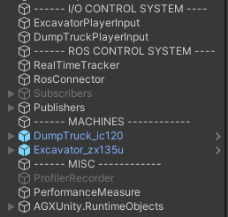
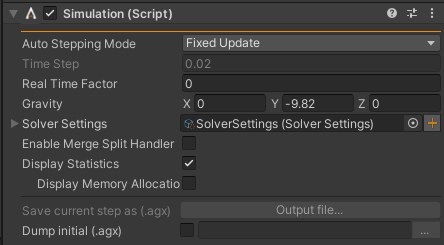
.. |image5| image:: media/image10.png
   :width: 1.82527in
   :height: 1.86126in
.. |グラフィカル ユーザー インターフェイス, アプリケーション 自動的に生成された説明| image:: media/image12.png
   :width: 1.87292in
   :height: 0.77778in
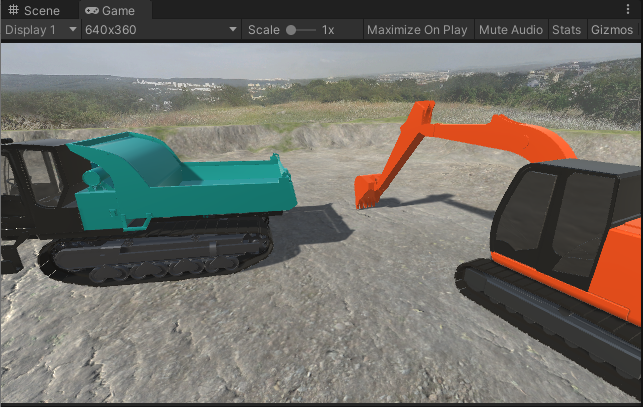
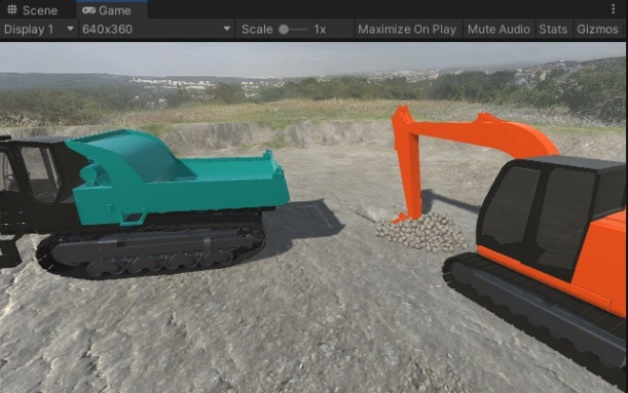
.. |グラフィカル ユーザー インターフェイス 自動的に生成された説明| image:: media/image15.png
   :width: 2.8in
   :height: 1.76162in
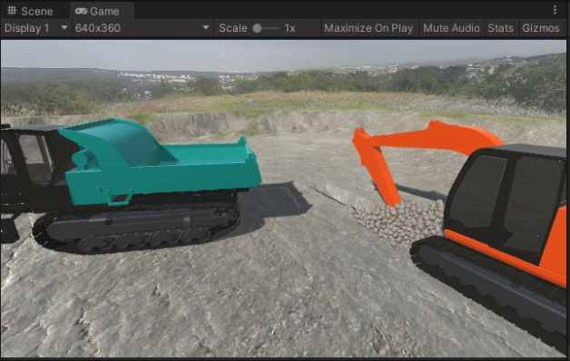
.. |image7| image:: media/image24.png
   :width: 4.71442in
   :height: 1.39437in
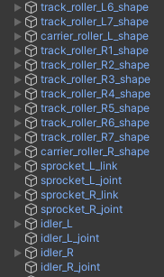
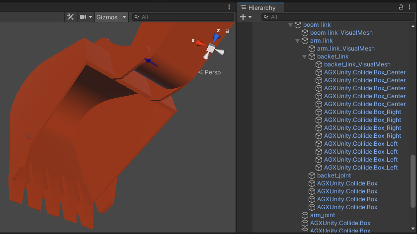
.. |image10| image:: media/image32.png
   :width: 2.65811in
   :height: 2.95255in
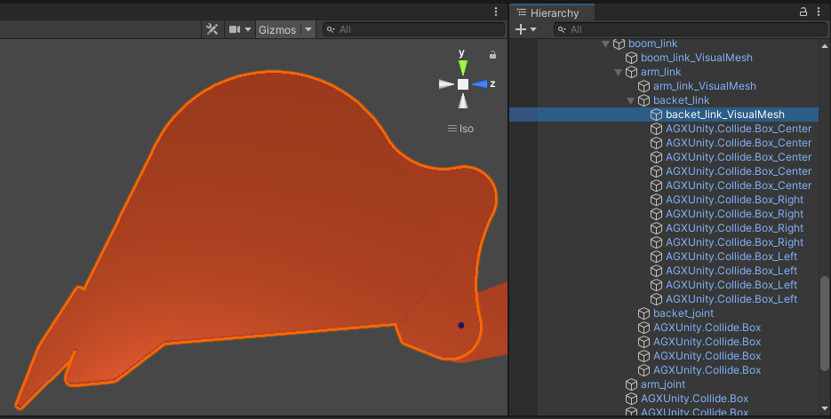
.. |image12| image:: media/image35.png
   :width: 2.77965in
   :height: 2.04962in
.. |image13| image:: media/image36.png
   :width: 2.72846in
   :height: 2.9477in
.. |image14| image:: media/image36.png
   :width: 2.8661in
   :height: 2.93977in
.. |image15| image:: media/image39.png
   :width: 5.90556in
   :height: 2.33472in
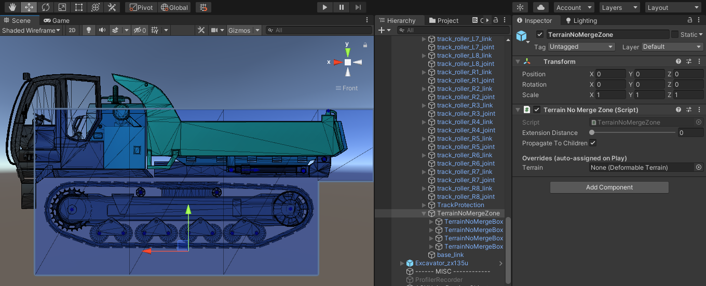

.. |image18| image:: media/image45.png
   :width: 2.85827in
   :height: 2.93255in
.. |image19| image:: media/image46.png
   :width: 2.85827in
   :height: 2.94703in
.. |image20| image:: media/image68.png
   :width: 2.74254in
   :height: 1.746in
.. |image21| image:: media/image66.png
   :width: 1.56594in

