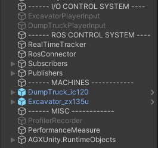
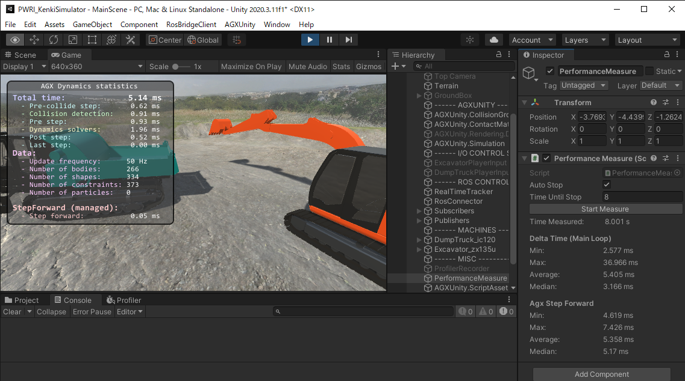
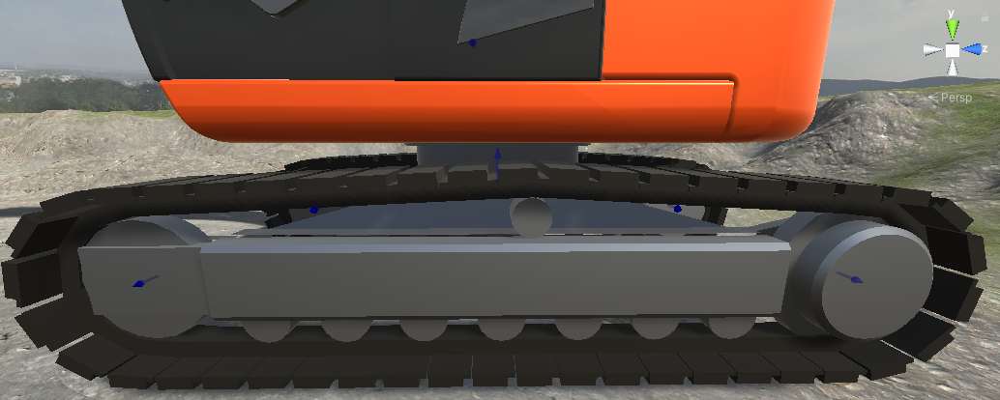
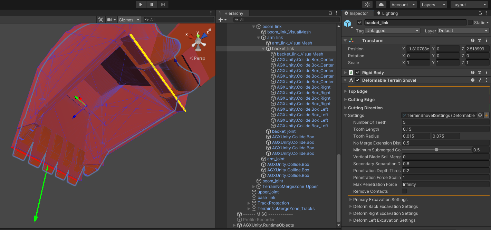

シミュレーション機能の説明
==========================

AGXUnity Terrainについて
------------------------

概要
~~~~

以下の画像の通り、MainSceneのHierarchyウィンドウにあるTerrain
GameObjectを選択すると、InspectorウィンドウからTerrainの設定にアクセスができる。

.. image:: media/image47.png
   :width: 5.89583in
   :height: 2.92551in

...（中略：既存内容）...

-  ロックしたときに土砂放土機能が発生しないように、ロックが有効化・無効化したときに\ **Unity
   Event**\ を発生させ、そのイベントをDump Soil
   ComponentのEnableSpawnParticles、DisableSpawnParticlesメソッドと繋がっているよう設定した。（この２つメソッドはDump
   SoilのSpawn Particles Enabledプロパティを設定する）。

.. |image1| image:: media/image6.png
   :width: 0.19948in
   :height: 0.13543in

.. |image3| image:: media/image8.png
   :width: 2.5662in
   :height: 1.35944in
.. |image4| image:: media/image9.png
   :width: 3.39532in
   :height: 1.87355in

.. |グラフィカル ユーザー インターフェイス, アプリケーション 自動的に生成された説明| image:: media/image12.png
   :width: 1.87292in
   :height: 0.77778in
.. |グラフィカル ユーザー インターフェイス, Web サイト 自動的に生成された説明| image:: media/image13.png
   :width: 2.848in
   :height: 1.78879in
.. |座る, フロント, ベンチ, テーブル が含まれている画像 自動的に生成された説明| image:: media/image14.jpeg
   :width: 2.8365in
   :height: 1.78328in
.. |グラフィカル ユーザー インターフェイス 自動的に生成された説明| image:: media/image15.png
   :width: 2.8in
   :height: 1.76162in
.. |image6| image:: media/image16.jpeg
   :width: 2.82076in
   :height: 1.76806in

.. |image8| image:: media/image25.png
   :width: 0.98602in
   :height: 1.39703in
.. |image9| image:: media/image33.png
   :width: 2.65442in
   :height: 2.9917in
.. |image10| image:: media/image32.png
   :width: 2.65811in
   :height: 2.95255in
.. |image11| image:: media/image34.png
   :width: 2.8127in
   :height: 2.04271in
.. |image12| image:: media/image35.png
   :width: 2.77965in
   :height: 2.04962in

.. |image15| image:: media/image39.png
   :width: 5.90556in
   :height: 2.33472in
.. |image16| image:: media/image43.png
   :width: 5.2997in
   :height: 4.43874in
.. |image17| image:: media/image43.png
   :width: 5.33908in
   :height: 3.42709in
.. |image18| image:: media/image45.png
   :width: 2.85827in
   :height: 2.93255in
.. |image19| image:: media/image46.png
   :width: 2.85827in
   :height: 2.94703in
.. |image20| image:: media/image68.png
   :width: 2.74254in
   :height: 1.746in
.. |image21| image:: media/image66.png
   :width: 1.56594in
