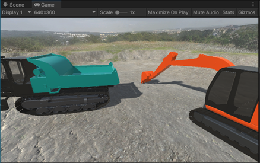
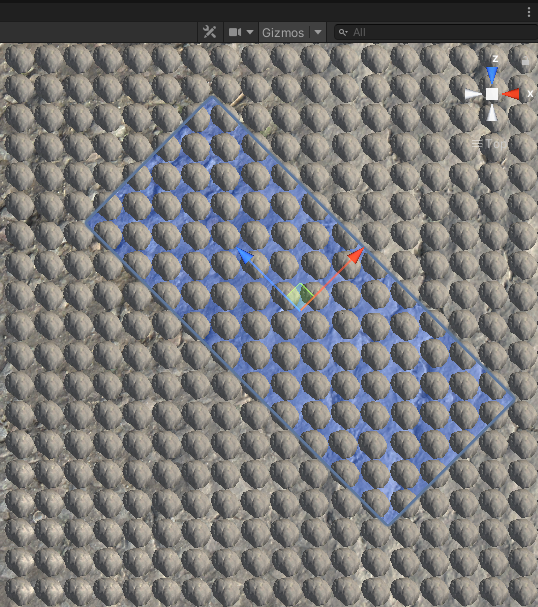
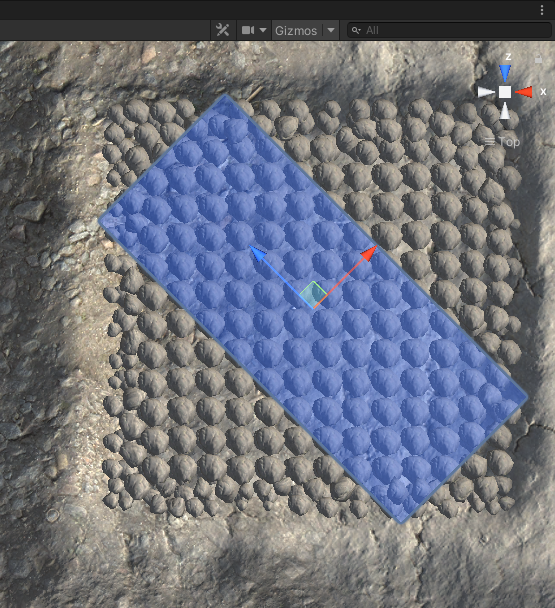
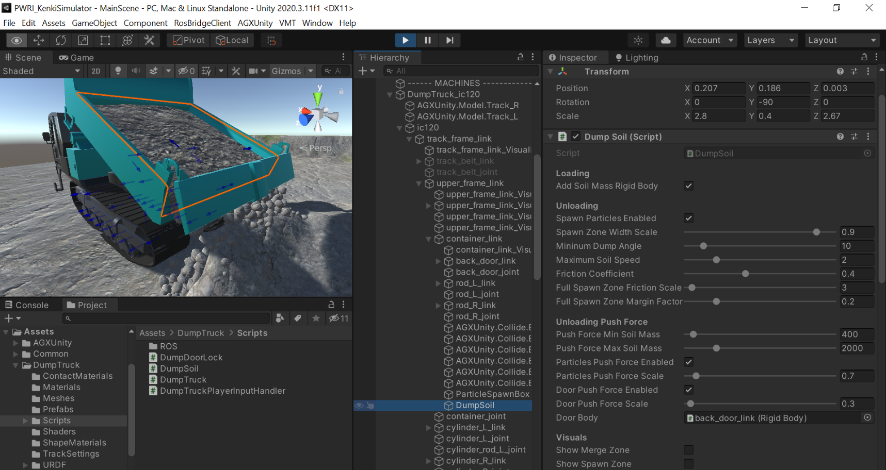

【参考】シミュレーション機能の説明
==========================

AGXUnity Terrainについて
------------------------

概要
~~~~

以下の画像の通り、MainSceneのHierarchyウィンドウにあるTerrain
GameObjectを選択すると、InspectorウィンドウからTerrainの設定にアクセスができる。

.. image:: media/image47.png
   :width: 5.89583in
   :height: 2.92551in

...（中略：既存内容）...

-  ロックしたときに土砂放土機能が発生しないように、ロックが有効化・無効化したときに\ **Unity
   Event**\ を発生させ、そのイベントをDump Soil
   ComponentのEnableSpawnParticles、DisableSpawnParticlesメソッドと繋がっているよう設定した。（この２つメソッドはDump
   SoilのSpawn Particles Enabledプロパティを設定する）。

.. |image1| image:: media/image6.png
   :width: 0.19948in
   :height: 0.13543in
.. |image2| image:: media/image7.png
   :width: 2.65562in
   :height: 1.35299in
.. |image3| image:: media/image8.png
   :width: 2.5662in
   :height: 1.35944in
.. |image4| image:: media/image9.png
   :width: 3.39532in
   :height: 1.87355in
.. |image5| image:: media/image10.png
   :width: 1.82527in
   :height: 1.86126in
.. |グラフィカル ユーザー インターフェイス, アプリケーション 自動的に生成された説明| image:: media/image12.png
   :width: 1.87292in
   :height: 0.77778in
.. |グラフィカル ユーザー インターフェイス, Web サイト 自動的に生成された説明| image:: media/image13.png
   :width: 2.848in
   :height: 1.78879in
.. |座る, フロント, ベンチ, テーブル が含まれている画像 自動的に生成された説明| image:: media/image14.jpeg
   :width: 2.8365in
   :height: 1.78328in

.. |image6| image:: media/image16.jpeg
   :width: 2.82076in
   :height: 1.76806in
.. |image7| image:: media/image24.png
   :width: 4.71442in
   :height: 1.39437in
.. |image8| image:: media/image25.png
   :width: 0.98602in
   :height: 1.39703in
.. |image9| image:: media/image33.png
   :width: 2.65442in
   :height: 2.9917in
.. |image10| image:: media/image32.png
   :width: 2.65811in
   :height: 2.95255in
.. |image11| image:: media/image34.png
   :width: 2.8127in
   :height: 2.04271in
.. |image12| image:: media/image35.png
   :width: 2.77965in
   :height: 2.04962in
.. |image13| image:: media/image36.png
   :width: 2.72846in
   :height: 2.9477in
.. |image14| image:: media/image36.png
   :width: 2.8661in
   :height: 2.93977in
.. |image15| image:: media/image39.png
   :width: 5.90556in
   :height: 2.33472in
.. |image16| image:: media/image43.png
   :width: 5.2997in
   :height: 4.43874in
.. |image17| image:: media/image43.png
   :width: 5.33908in
   :height: 3.42709in

.. |image21| image:: media/image66.png
   :width: 1.56594in

シミュレーションパフォーマンスについて
--------------------------------------

ベンチマーク
~~~~~~~~~~~~

参考としてパフォーマンスベンチマークを実施した。操作手順は以下の通り。

*ベンチマークシナリオ１：スタンバイ*

**初期**

-  プログラムの初期姿勢をそのまま

-  |グラフィカル ユーザー インターフェイス, アプリケーション
   自動的に生成された説明|\ Sceneウィンドウを使わず、解像度640x360のGameウィンドウのみでシミュレーションを表示。

**操作**

-  指令値を動かさない

-  PerformanceMeasure
   Componentを利用して8秒間のパフォーマンスを測定する。

.. image:: media/image10.png
   :width: 3.34167in
   :height: 2.11075in

+---------------------+------------------------+----------------------+
| **結果**            | **AGX                  | **UnityのFrame時間** |
|                     | Dynamicsステップ時間** |                      |
+=====================+========================+======================+
| 最低値              | 4.619 ms               | 2.577 ms             |
+---------------------+------------------------+----------------------+
| 最大値              | 7.426 ms               | 36.966 ms            |
+---------------------+------------------------+----------------------+
| 平均                | 5.358 ms               | 5.405 ms             |
+---------------------+------------------------+----------------------+
| 中央値              | 5.170 ms               | 3.166 ms             |
+---------------------+------------------------+----------------------+

*ベンチマークシナリオ２A：掘削動作（粒子数：430個）*

**初期**

-  初期姿勢から、バケットが地面に接地する直前の位置になるように\ **アームの指令値を0.7
   radian**\ に設定し、これをベンチマークの初期姿勢とする。

-  Terrain MaterialのPresetをDirtに設定。

-  Sceneウィンドウを使わず、解像度640x360のGameウィンドウだけでシミュレーションを表示。

**操作**

-  ROSのサンプルプログラムを使い最大速度（0.4
   radian/s）でアームを動かして、PerformanceMeasureを利用して8秒間パフォーマンスを測定する。

-  動作については、「Benchmark_DiggingUsingOnlyArm_A_Dirt.
   mp4」動画を参照。

-  測定時の最大粒子数は\ **430個**\ になった。

　　　**初期姿勢：**　　　　　　　　　　　　　**終了姿勢（8秒後）：**

|グラフィカル ユーザー インターフェイス, Web サイト
自動的に生成された説明|　|座る, フロント, ベンチ, テーブル
が含まれている画像 自動的に生成された説明|

+---------------------+------------------------+----------------------+
| **結果**            | **AGX                  | **UnityのFrame時間** |
|                     | Dynamicsステップ時間** |                      |
+=====================+========================+======================+
| 最低値              | 5.893 ms               | 2.773 ms             |
+---------------------+------------------------+----------------------+
| 最大値              | 23.39 ms               | 55.531 ms            |
+---------------------+------------------------+----------------------+
| 平均                | 10.643 ms              | 15.676 ms            |
+---------------------+------------------------+----------------------+
| 中央値              | 9.894 ms               | 15.909 ms            |
+---------------------+------------------------+----------------------+

*ベンチマークシナリオ２B：掘削動作（粒子数：950個）*

**初期**

-  初期姿勢から、バケットが地面に接地する直前の位置になるように\ **アームの指令値を0.3
   radian**\ 、\ **ブームの指令値を0.15
   radian**\ まで動かし、ベンチマークの初期姿勢とする。

-  Excavator_zx135uのInspector経由でアームの\ **Max Forceを300000
   N**\ に設定。

-  Terrain MaterialのPresetはDirtに設定。

-  Sceneウィンドウを使わず、解像度640x360のGameウィンドウのみでシミュレーションを表示。

**操作**

-  ROSのサンプルプログラムを使い最大速度（0.4
   radian/s）でアームを動かして、PerformanceMeasureを利用して8秒間パフォーマンスを測定する。

-  動作については「Benchmark_DiggingUsingOnlyArm_B_Dirt.
   mp4」動画を参照。

-  測定時の最大粒子数は\ **950個**\ となった。

　　　**初期姿勢：**　　　　　　　　　　　　　**終了姿勢（8秒後）：**

|グラフィカル ユーザー インターフェイス
自動的に生成された説明|　|image6|

+---------------------+------------------------+----------------------+
| **結果**            | **AGX                  | **UnityのFrame時間** |
|                     | Dynamicsステップ時間** |                      |
+=====================+========================+======================+
| 最低値              | 6.688 ms               | 2.907 ms             |
+---------------------+------------------------+----------------------+
| 最大値              | 19.411 ms              | 68.496 ms            |
+---------------------+------------------------+----------------------+
| 平均                | 13.109 ms              | 27.364 ms            |
+---------------------+------------------------+----------------------+
| 中央値              | 12.814 ms              | 24.797 ms            |
+---------------------+------------------------+----------------------+

*ベンチマークシナリオ3：一連のオペレーションサイクル（掘削→積載→運搬→放土）*

**初期**

-  プログラムの初期姿勢を使用

-  Terrain MaterialのPresetをDirtに設定。

-  Sceneウィンドウを使わず、解像度640x360のGameウィンドウだけでシミュレーションを表示

**操作**

-  バケットによって荷台に土砂を積載する動作を3回実施し、その後クローラダンプで土砂運搬し、放土する。

-  動作については、「Benchmark_FullCycle_Dirt.mp4」の動画を参照。

　

+---------------------+------------------------+----------------------+
| **結果**            | **AGX                  | **UnityのFrame時間** |
|                     | Dynamicsステップ時間** |                      |
+=====================+========================+======================+
| 最低値              | 4.679 ms               | 2.581 ms             |
+---------------------+------------------------+----------------------+
| 最大値              | 25.033 ms              | 54.747 ms            |
+---------------------+------------------------+----------------------+
| 平均                | 7.76 ms                | 8.273 ms             |
+---------------------+------------------------+----------------------+
| 中央値              | 6.782 ms               | 6.868 ms             |
+---------------------+------------------------+----------------------+

シミュレーションパフォーマンスのまとめ
~~~~~~~~~~~~~~~~~~~~~~~~~~~~~~~~~~~~~~

上記ベンチマークの結果より、評価用の開発環境では、1000個程度の粒子が発生するシナリオに対して、リアルタイムでのシミュレーションを実現することができた。

なお、\ **”RealTimeTracker : Unity has skipped XXXs game time (at frame
X)”**\ というメッセージがConsoleウィンドウに出力された場合には、UnityのFrame演算時間がMaximum
Allowed
Timestepより大きくなったことを意味し、リアルタイムでの実行ができなかったことが分かる。

.. |image1| image:: media/image6.png
   :width: 0.19948in
   :height: 0.13543in
.. |image2| image:: media/image7.png
   :width: 2.65562in
   :height: 1.35299in
.. |image3| image:: media/image8.png
   :width: 2.5662in
   :height: 1.35944in
.. |image4| image:: media/image9.png
   :width: 3.39532in
   :height: 1.87355in
.. |image5| image:: media/image10.png
   :width: 1.82527in
   :height: 1.86126in
.. |グラフィカル ユーザー インターフェイス, アプリケーション 自動的に生成された説明| image:: media/image12.png
   :width: 1.87292in
   :height: 0.77778in
.. |グラフィカル ユーザー インターフェイス, Web サイト 自動的に生成された説明| image:: media/image13.png
   :width: 2.848in
   :height: 1.78879in
.. |座る, フロント, ベンチ, テーブル が含まれている画像 自動的に生成された説明| image:: media/image14.jpeg
   :width: 2.8365in
   :height: 1.78328in

.. |image6| image:: media/image16.jpeg
   :width: 2.82076in
   :height: 1.76806in
.. |image7| image:: media/image24.png
   :width: 4.71442in
   :height: 1.39437in
.. |image8| image:: media/image25.png
   :width: 0.98602in
   :height: 1.39703in
.. |image9| image:: media/image33.png
   :width: 2.65442in
   :height: 2.9917in
.. |image10| image:: media/image32.png
   :width: 2.65811in
   :height: 2.95255in
.. |image11| image:: media/image34.png
   :width: 2.8127in
   :height: 2.04271in
.. |image12| image:: media/image35.png
   :width: 2.77965in
   :height: 2.04962in
.. |image13| image:: media/image36.png
   :width: 2.72846in
   :height: 2.9477in
.. |image14| image:: media/image36.png
   :width: 2.8661in
   :height: 2.93977in
.. |image15| image:: media/image39.png
   :width: 5.90556in
   :height: 2.33472in
.. |image16| image:: media/image43.png
   :width: 5.2997in
   :height: 4.43874in
.. |image17| image:: media/image43.png
   :width: 5.33908in
   :height: 3.42709in

.. |image21| image:: media/image66.png
   :width: 1.56594in
