システム概要・構成
==================

開発環境
--------

ソフトウェア要件
~~~~~~~~~~~~~~~~

+------------------------+---------------------------------------------+
| **Windows PC**         | **バージョン**                              |
+========================+=============================================+
| Windows                | 10                                          |
+------------------------+---------------------------------------------+
| Unity                  | 2020.3.11f1（\ `link <https://uni           |
|                        | ty3d.com/get-unity/download/archive>`__\ ） |
+------------------------+---------------------------------------------+
| AGX Dynamics For Unity | 2.4.2 (AGX Dynamics 2.3.30.0に同梱)         |
|                        |                                             |
|                        | ※納品するプロジェクトにインストール済       |
+------------------------+---------------------------------------------+

+------------------------+---------------------------------------------+
| **Ubuntu PC**          | **バージョン**                              |
+========================+=============================================+
| Ubuntu                 | 18.04（Bionic）                             |
+------------------------+---------------------------------------------+
| ROS                    | Melodic                                     |
+------------------------+---------------------------------------------+
| ROS Bridge             | ROS Melodic用                               |
| Server（\ `link <      |                                             |
| http://wiki.ros.org/ro |                                             |
| sbridge_server>`__\ ） |                                             |
+------------------------+---------------------------------------------+
| ROS                    | ROS Melodic用                               |
| J                      |                                             |
| oy（\ `link <http://wi |                                             |
| ki.ros.org/joy>`__\ ） |                                             |
+------------------------+---------------------------------------------+

テストに使用したハードウェアスペック
~~~~~~~~~~~~~~~~~~~~~~~~~~~~~~~~~~~~

+------------------------+---------------------------------------------+
| **Windows PC**         | **スペック**                                |
+========================+=============================================+
| プロセッサー           | Intel® Core™ i9-9900KF CPU @ 3.60           |
|                        | GHzプロセッサー                             |
|                        | ベース動作周波数                            |
|                        | 、5.00GHzターボ・ブースト利用時の最大周波数 |
|                        | 、8個のコア、16個のロジカルプロセッサー、16 |
|                        | MB Intel® Smart Cache                       |
+------------------------+---------------------------------------------+
| メモリー               | 32 GB                                       |
+------------------------+---------------------------------------------+
| ＧＰＵ                 | NVIDIA GeForce GTX 1660 Ti、６GB            |
+------------------------+---------------------------------------------+
| ストレージ             | 512 GB SSD PCIe                             |
+------------------------+---------------------------------------------+

+------------------------+---------------------------------------------+
| **Ubuntu PC**          | **スペック**                                |
+========================+=============================================+
| プロセッサー           | Intel® Core™ i7-5600 CPU @ 2.60 GHz,        |
|                        | 2個のコア、4個のスレッド                    |
+------------------------+---------------------------------------------+
| メモリー               | 16 GB                                       |
+------------------------+---------------------------------------------+
| ＧＰＵ                 | ―                                           |
+------------------------+---------------------------------------------+
| ストレージ             | 256. GB SATA Gen3 SSD                       |
+------------------------+---------------------------------------------+
| 入力デバイス           | PS4コントローラ                             |
+------------------------+---------------------------------------------+

システム構成
------------

システムは２つパソコンで構成され、Ubuntuパソコン内に制御システムとROSが動作し、Windowsパソコン内でUnity（AGX
Dynamics）のシミュレーションが動作する。この２つのシステム間のデータ通信にROSBridge/ROS#を利用している。

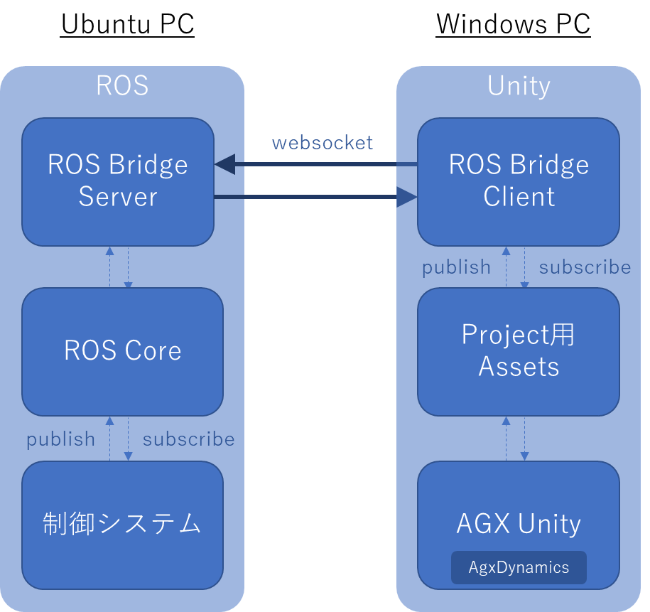

*ファイル構成*

提供したDVDの主なファイル構成は以降の通り。

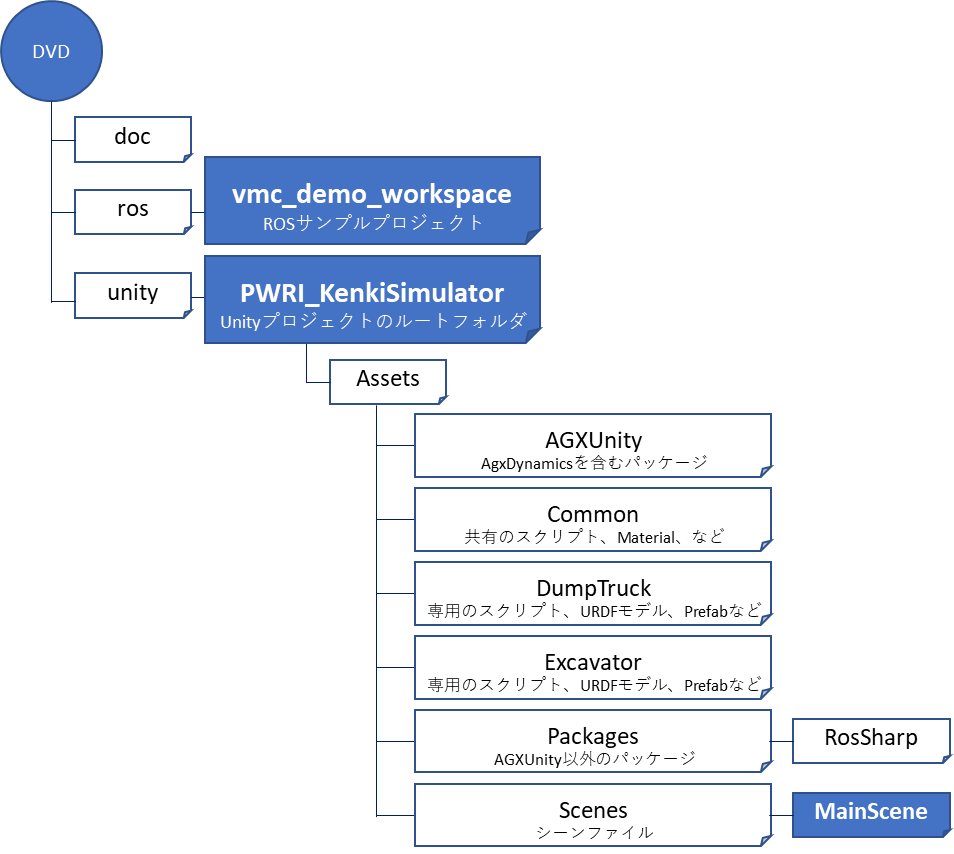

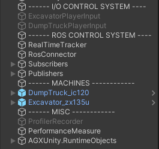
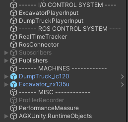
.. |image4| image:: media/image9.png
   :width: 3.39532in
   :height: 1.87355in
.. |image5| image:: media/image10.png
   :width: 1.82527in
   :height: 1.86126in
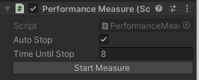
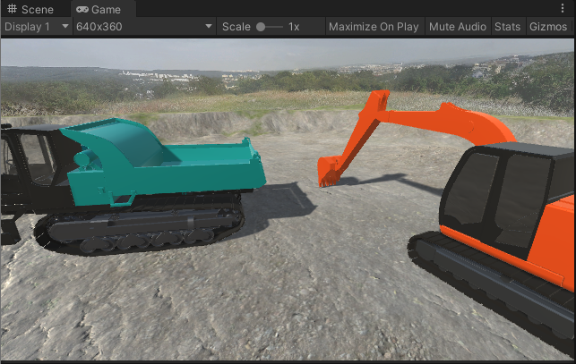
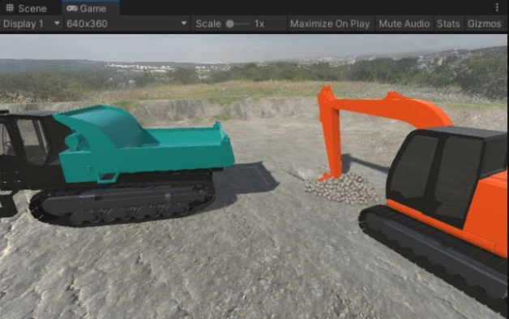
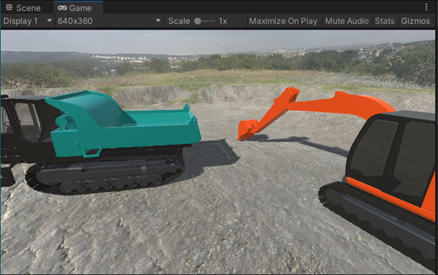
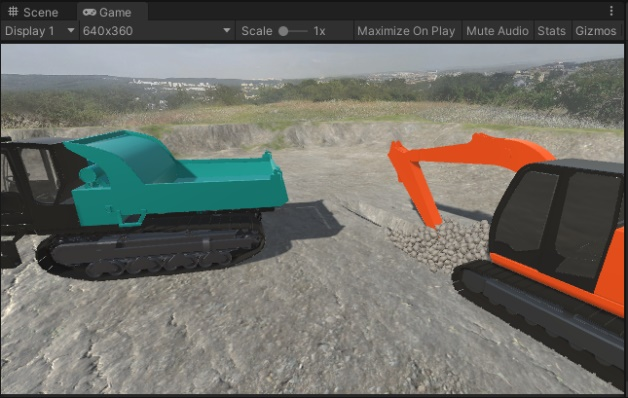
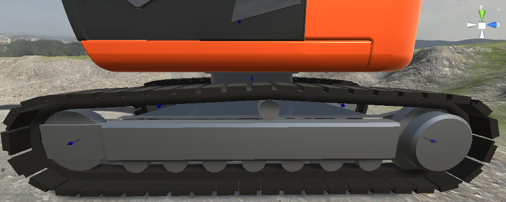
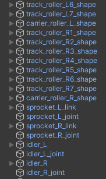
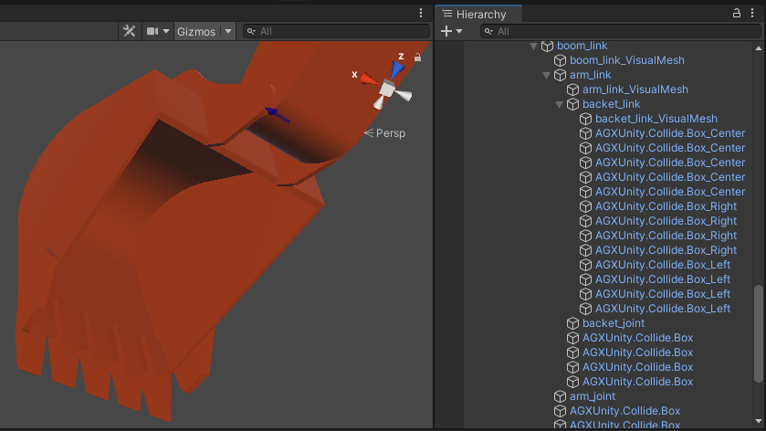
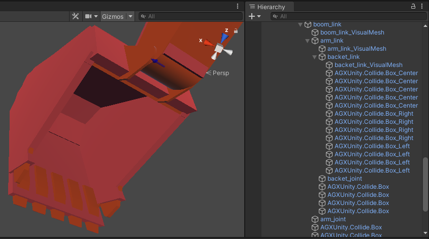
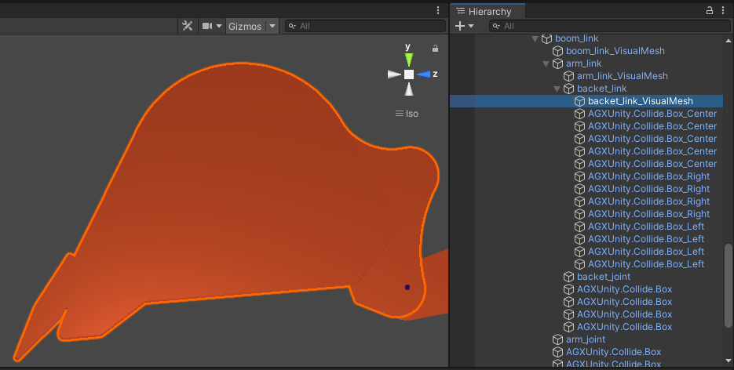
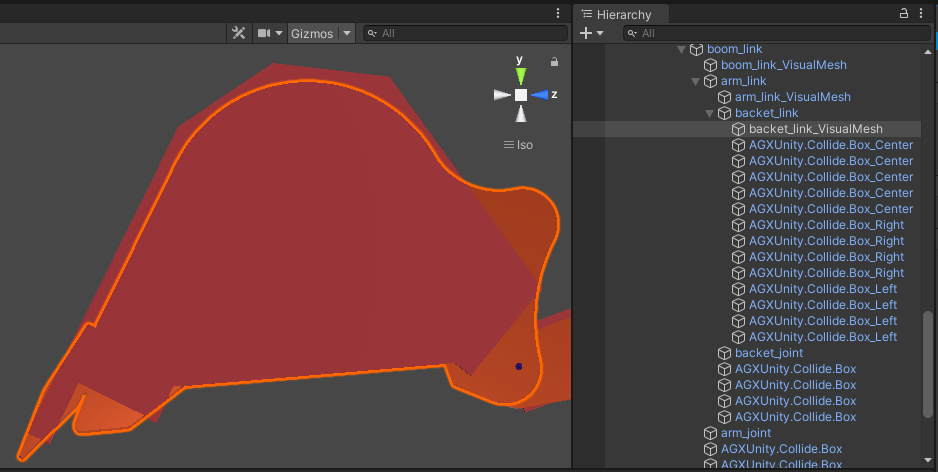
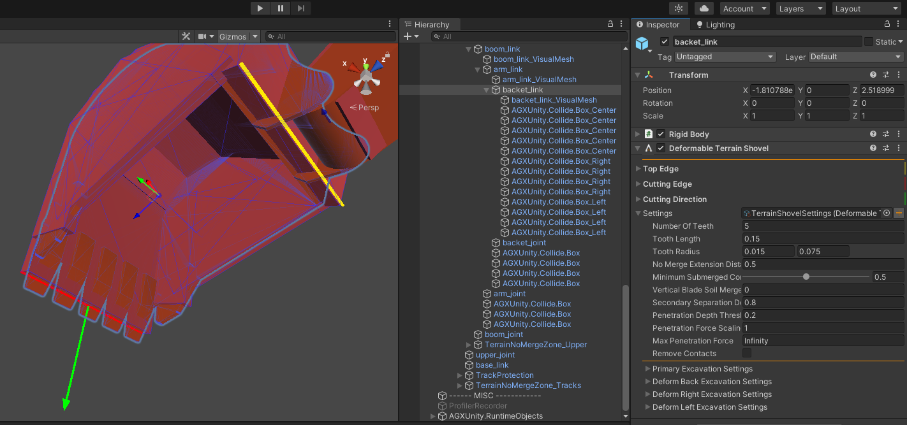

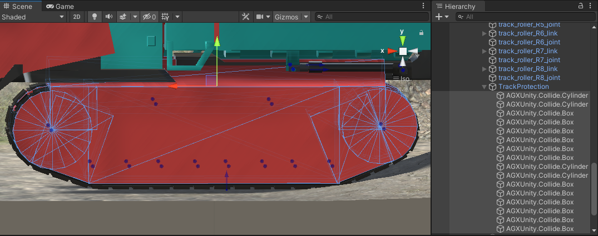
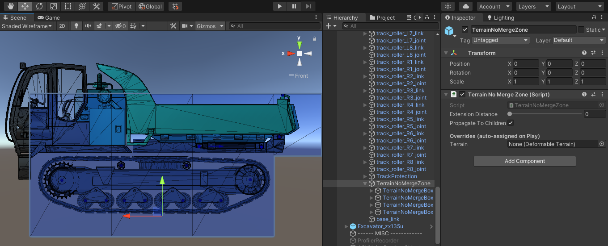

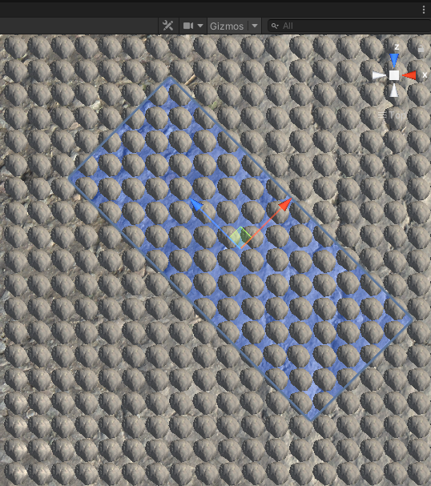
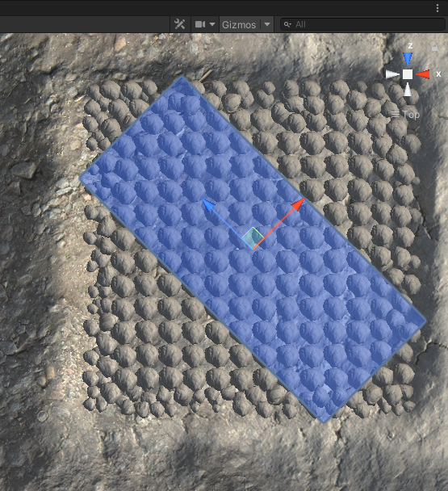
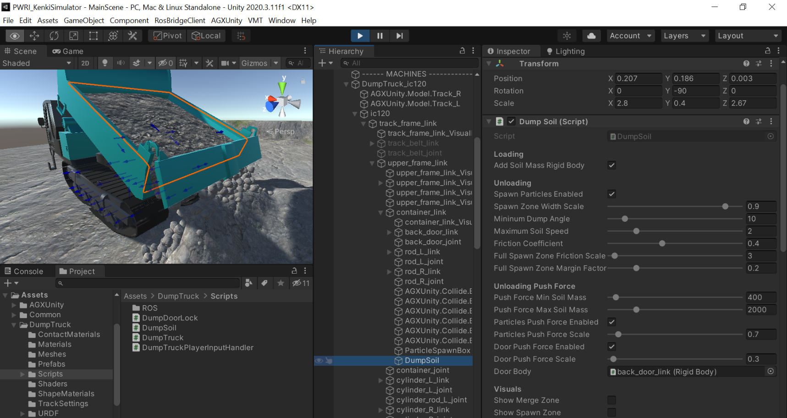
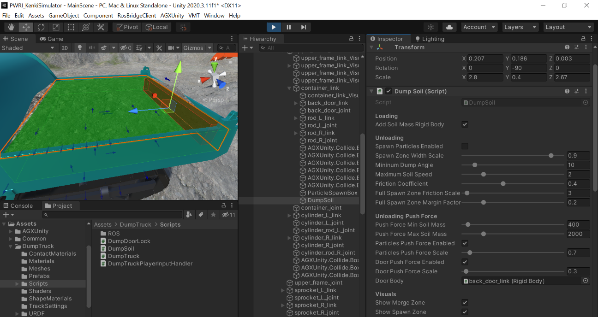
