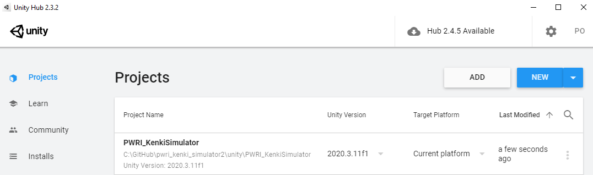
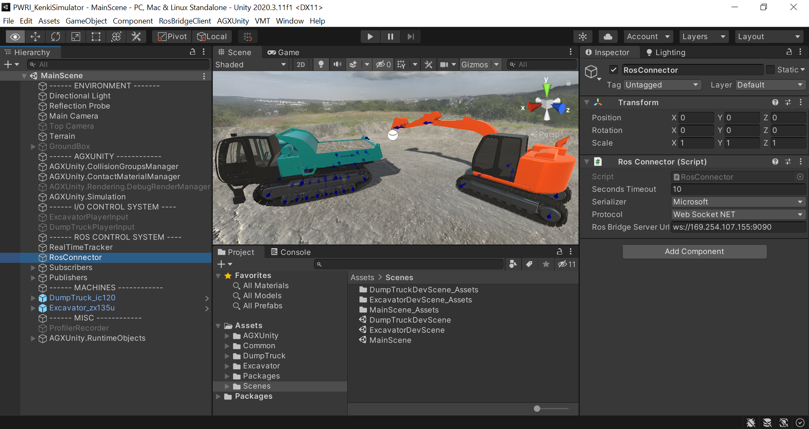
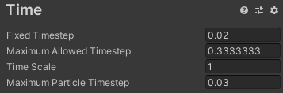
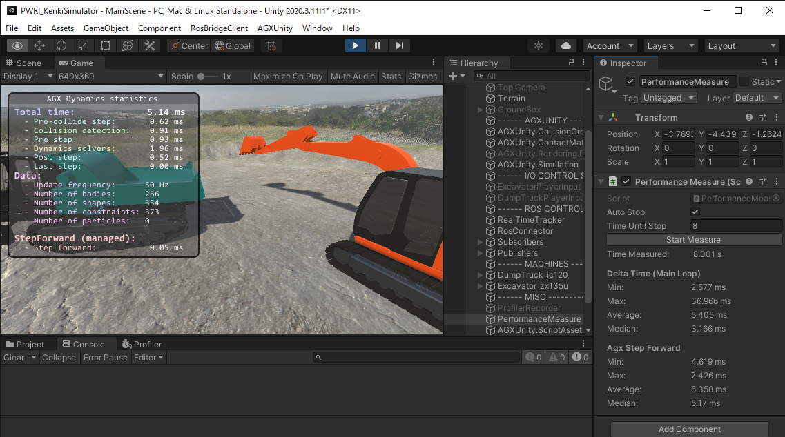

システムの実行・一般的な操作方法
================================

Unityプロジェクトの実行方法
---------------------------

*Unityプロジェクトのパス：*

**/unity/PWRI_KenkiSimulator**

*インストール：*

1. `Unity
   Hubをインストール <https://unity3d.com/jp/get-unity/download>`__\ し実行。

2. InstallsタブからUnityバージョン（2020.3.11f1）を追加。

3. Projectsタブからプロジェクトを追加（/unity/PWRI_KenkiSimulatorフォルダを選択）。

*実行：*

1. Projectsタブに追加されたプロジェクトのタイトルを押し、Unity
   Editorで開く。

2. Unity
   EditorのHierarchyウィンドウにMainSceneが表示されていない場合には、ProjectウィンドウからAssets/Scenes/MainScene.unityをダブルクリックしてシーンをロードする。

3. Assets/AGXUnity/Plugins/x86_64のフォルダへ\ **AGX
   Dynamicsのライセンスファイル**\ をコピーペースト。

4. HierarchyウィンドウからRosConnectorというGameObjectを選択し、Inspectorウィンドウから\ **ROS
   Bridge Server Url**\ をUbuntu側の設定に合わせて調整する。

5. Playボタン（\ |image1|\ ）を押してシミュレーションを実行。

*注意点：*\ UnityプロジェクトをPlayする前にROSパソコン上でRos Bridge
Serverを実行しておく必要がある。

ROSサンプルプロジェクトの実行方法
---------------------------------

*ROSサンプルプロジェクトのワークスペースパス：*

**/ros/vmc_demo_workspace**

*インストール*\ ：

1. ROS Melodic、joy、rosbridge_serverをインストール

2. ワーキングディレクトリを\ **/ros/vmc_demo_workspace**\ に設定

3. **catkin_make**\ を実行

*実行：*

1. **roscore**\ を実行

2. **roslaunch rosbridge_server rosbridge_websocket.launch**\ を実行

3. ワーキングディレクトリを\ **/ros/vmc_demo_workspace**\ に設定

4. **source devel/setup.bash**\ を実行

5. **roslaunch vmc_demo zx120_demo_joystick.launch**\ を実行

システムの操作方法
------------------

*ROSパソコン上での操作について*

zx120_demo_joystick.launchが実行する「zx120_js2cmd_ext」ノードは、joy_node経由でROSパソコンに接続したPS4ゲームパッドの入力を読み込み、指定した周波数で各アクチュエータの指令値を計算してPublishする。ROS
Bridge ServerはPublishされたデータをUnity内でSubscribeできるようにする。

+---------------------+------------+---------+----+------------------+
| **対象軸**          | **Gam      | **Mess  | ** | **Topic名**      |
|                     | epad入力** | age型** | 指 |                  |
|                     |            |         | 令 |                  |
|                     |            |         | ** |                  |
+=====================+============+=========+====+==================+
| 車体旋回の角度      | 左S        | Float64 | 角 | /z               |
|                     | tickの左右 |         | 度 | x120/rotator/cmd |
+---------------------+------------+---------+----+------------------+
| ブームの角度        | 右S        | Float64 | 角 | /zx120/boom/cmd  |
|                     | tickの上下 |         | 度 |                  |
+---------------------+------------+---------+----+------------------+
| アームの角度        | 左S        | Float64 | 角 | /zx120/arm/cmd   |
|                     | tickの上下 |         | 度 |                  |
+---------------------+------------+---------+----+------------------+
| バケットの角度      | 右S        | Float64 | 角 | /                |
|                     | tickの左右 |         | 度 | zx120/backet/cmd |
+---------------------+------------+---------+----+------------------+
| 油圧                | L1         | Twist   | 速 | /zx12            |
| ショベルの履帯速度  | /L2、R1/R2 |         | 度 | 0/tracks/cmd_vel |
+---------------------+------------+---------+----+------------------+
| 荷台の角度          | 〇/☓ボタン | Float64 | 角 | /                |
|                     |            |         | 度 | ic120/vessel/cmd |
+---------------------+------------+---------+----+------------------+
| クロー              | 十字キー   | Twist   | 速 | /ic12            |
| ラダンプの履帯速度  |            |         | 度 | 0/tracks/cmd_vel |
+---------------------+------------+---------+----+------------------+

※サンプルプロジェクトではjoy_nodeのL2、R2の初期値が０ではないため、シミュレーション開始時に油圧ショベルが勝手に前進する可能性があるが、L2、R2を一度押すと速度0にリセットされる。

*Unityパソコン上での操作について*

ROSからの指令で操作するのでUnity内の操作は基本的には不要。

ただし、デバッグのため、ゲームパッド・キーボードで操作する機能を開発した。切り替えには、シミュレーション実行前に以下の手順を行う：

1. MainSceneの「Subscribers」のGameObjectの無効化

2. 「ExcavatorPlayerInput」、「DumpTruckPlayerInput」のGameObjectを有効化

3. Play時に、キーボードの入力が検出されるようにGameウィンドウがアクティブウィンドウになっている必要がある（ウィンドウ上をクリックするとアクティブとなる）

|image2|　|image3|

**Assets/Common/InputSystem/InputActions.inputactions**\ というAsset経由でボタンマッピングを変更することができる。

このモードでは、全ての指令は自動的に速度型となる。

*AGX Dynamicsのパフォーマンスの確認方法*

MainSceneのAGXUnity.SimulationというGameObjectのInspector
GUIから「Display
Statistics」のチェックボックスをチェックすると、Play時にGameウィンドウ内にAGX
Dynamicsの時間データが表示される。

|image4|　　|image5|

*※*\ タイムステップの設定は、AGXUnity.Simulationではなく、Project
SettingsのTimeセクションからアクセスできる。さらに、タイムステップの上限を設定するには、Real
Time Factorの代わりにUnityのMaximum Allowed Timestepを設定する。

制限事項、注意点
----------------

*制限事項*

-  UnityプロジェクトをPlayする前にROSパソコン上でRos Bridge
   Serverを実行しないと接続できない（またはPlay開始後、RosConnectorのInspectorで設定したTimeout以内にRos
   Bridge Serverを実行）。

-  Play時にROSパソコンへの接続が切れた場合は、シミュレーションをStopしてから再度Playする必要がある。

*注意点*

-  頻繁に値が更新されるプロパティを持つComponentをInspectorで表示するとパフォーマンスが下がる可能性がある。Inspectorは編集、デバッグのみに使用し、データ表示用のGUIはGameウィンドウ内、またはROS側に置くことを推奨する。

-  SceneウィンドウとGameウィンドウを同時に表示するとパフォーマンスが下がる。

-  ROSパソコンのパフォーマンスや通信状況によって、ROSパソコンからのポジション指令の周波数が不安定になると、シミュレーションがスムーズに動作せず、シミュレーションから得られる力、速度などの情報も安定してROS側にフィードバックすることができなくなる。

-  シミュレーション内の粒子数が増えすぎると、パフォーマンスが低下しインタラクティブに操作ができなくなる。そのため、デモ等でリアルタイムシミュレーションが要求される時には、粒子数が増えすぎないようにすることを推奨する。

シミュレーションパフォーマンスについて
--------------------------------------

ベンチマーク
~~~~~~~~~~~~

参考としてパフォーマンスベンチマークを実施した。操作手順は以下の通り。

*ベンチマークシナリオ１：スタンバイ*

**初期**

-  プログラムの初期姿勢をそのまま

-  |グラフィカル ユーザー インターフェイス, アプリケーション
   自動的に生成された説明|\ Sceneウィンドウを使わず、解像度640x360のGameウィンドウのみでシミュレーションを表示。

**操作**

-  指令値を動かさない

-  PerformanceMeasure
   Componentを利用して8秒間のパフォーマンスを測定する。

   自動的に生成された説明
   :width: 3.34167in
   :height: 2.11075in

+---------------------+------------------------+----------------------+
| **結果**            | **AGX                  | **UnityのFrame時間** |
|                     | Dynamicsステップ時間** |                      |
+=====================+========================+======================+
| 最低値              | 4.619 ms               | 2.577 ms             |
+---------------------+------------------------+----------------------+
| 最大値              | 7.426 ms               | 36.966 ms            |
+---------------------+------------------------+----------------------+
| 平均                | 5.358 ms               | 5.405 ms             |
+---------------------+------------------------+----------------------+
| 中央値              | 5.170 ms               | 3.166 ms             |
+---------------------+------------------------+----------------------+

*ベンチマークシナリオ２A：掘削動作（粒子数：430個）*

**初期**

-  初期姿勢から、バケットが地面に接地する直前の位置になるように\ **アームの指令値を0.7
   radian**\ に設定し、これをベンチマークの初期姿勢とする。

-  Terrain MaterialのPresetをDirtに設定。

-  Sceneウィンドウを使わず、解像度640x360のGameウィンドウだけでシミュレーションを表示。

**操作**

-  ROSのサンプルプログラムを使い最大速度（0.4
   radian/s）でアームを動かして、PerformanceMeasureを利用して8秒間パフォーマンスを測定する。

-  動作については、「Benchmark_DiggingUsingOnlyArm_A_Dirt.
   mp4」動画を参照。

-  測定時の最大粒子数は\ **430個**\ になった。

　　　**初期姿勢：**　　　　　　　　　　　　　**終了姿勢（8秒後）：**

|グラフィカル ユーザー インターフェイス, Web サイト
自動的に生成された説明|　|座る, フロント, ベンチ, テーブル
が含まれている画像 自動的に生成された説明|

+---------------------+------------------------+----------------------+
| **結果**            | **AGX                  | **UnityのFrame時間** |
|                     | Dynamicsステップ時間** |                      |
+=====================+========================+======================+
| 最低値              | 5.893 ms               | 2.773 ms             |
+---------------------+------------------------+----------------------+
| 最大値              | 23.39 ms               | 55.531 ms            |
+---------------------+------------------------+----------------------+
| 平均                | 10.643 ms              | 15.676 ms            |
+---------------------+------------------------+----------------------+
| 中央値              | 9.894 ms               | 15.909 ms            |
+---------------------+------------------------+----------------------+

*ベンチマークシナリオ２B：掘削動作（粒子数：950個）*

**初期**

-  初期姿勢から、バケットが地面に接地する直前の位置になるように\ **アームの指令値を0.3
   radian**\ 、\ **ブームの指令値を0.15
   radian**\ まで動かし、ベンチマークの初期姿勢とする。

-  Excavator_zx135uのInspector経由でアームの\ **Max Forceを300000
   N**\ に設定。

-  Terrain MaterialのPresetはDirtに設定。

-  Sceneウィンドウを使わず、解像度640x360のGameウィンドウのみでシミュレーションを表示。

**操作**

-  ROSのサンプルプログラムを使い最大速度（0.4
   radian/s）でアームを動かして、PerformanceMeasureを利用して8秒間パフォーマンスを測定する。

-  動作については「Benchmark_DiggingUsingOnlyArm_B_Dirt.
   mp4」動画を参照。

-  測定時の最大粒子数は\ **950個**\ となった。

　　　**初期姿勢：**　　　　　　　　　　　　　**終了姿勢（8秒後）：**

|グラフィカル ユーザー インターフェイス
自動的に生成された説明|　|image6|

+---------------------+------------------------+----------------------+
| **結果**            | **AGX                  | **UnityのFrame時間** |
|                     | Dynamicsステップ時間** |                      |
+=====================+========================+======================+
| 最低値              | 6.688 ms               | 2.907 ms             |
+---------------------+------------------------+----------------------+
| 最大値              | 19.411 ms              | 68.496 ms            |
+---------------------+------------------------+----------------------+
| 平均                | 13.109 ms              | 27.364 ms            |
+---------------------+------------------------+----------------------+
| 中央値              | 12.814 ms              | 24.797 ms            |
+---------------------+------------------------+----------------------+

*ベンチマークシナリオ3：一連のオペレーションサイクル（掘削→積載→運搬→放土）*

**初期**

-  プログラムの初期姿勢を使用

-  Terrain MaterialのPresetをDirtに設定。

-  Sceneウィンドウを使わず、解像度640x360のGameウィンドウだけでシミュレーションを表示

**操作**

-  バケットによって荷台に土砂を積載する動作を3回実施し、その後クローラダンプで土砂運搬し、放土する。

-  動作については、「Benchmark_FullCycle_Dirt.mp4」の動画を参照。

　

+---------------------+------------------------+----------------------+
| **結果**            | **AGX                  | **UnityのFrame時間** |
|                     | Dynamicsステップ時間** |                      |
+=====================+========================+======================+
| 最低値              | 4.679 ms               | 2.581 ms             |
+---------------------+------------------------+----------------------+
| 最大値              | 25.033 ms              | 54.747 ms            |
+---------------------+------------------------+----------------------+
| 平均                | 7.76 ms                | 8.273 ms             |
+---------------------+------------------------+----------------------+
| 中央値              | 6.782 ms               | 6.868 ms             |
+---------------------+------------------------+----------------------+

シミュレーションパフォーマンスのまとめ
~~~~~~~~~~~~~~~~~~~~~~~~~~~~~~~~~~~~~~

上記ベンチマークの結果より、評価用の開発環境では、1000個程度の粒子が発生するシナリオに対して、リアルタイムでのシミュレーションを実現することができた。

なお、\ **”RealTimeTracker : Unity has skipped XXXs game time (at frame
X)”**\ というメッセージがConsoleウィンドウに出力された場合には、UnityのFrame演算時間がMaximum
Allowed
Timestepより大きくなったことを意味し、リアルタイムでの実行ができなかったことが分かる。
