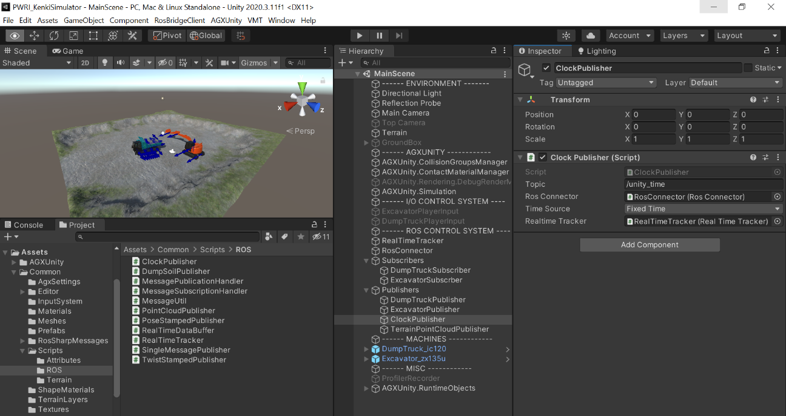
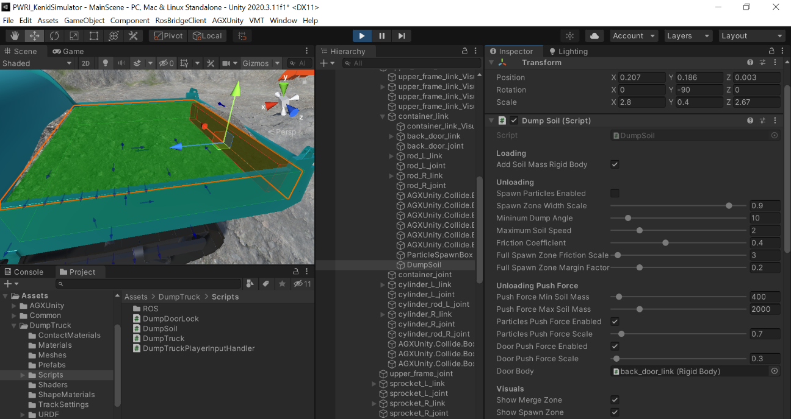

シミュレーション機能の説明
==========================

AGXUnity Terrainについて
------------------------

概要
~~~~

以下の画像の通り、MainSceneのHierarchyウィンドウにあるTerrain
GameObjectを選択すると、InspectorウィンドウからTerrainの設定にアクセスができる。

Terrain GameObjectは複数のComponentから構成されている。

+------------------+---------------------------------------------------+
| **Component名**  | **説明**                                          |
+==================+===================================================+
| Transform        | Terrainの位置                                     |
+------------------+---------------------------------------------------+
| Terrain          | Unity標                                           |
|                  | 準のTerrain。Terrainの見た目を編集するComponent。 |
|                  | Terrainの寸法、形、色などのプロパティを編集する。 |
|                  |                                                   |
|                  | ※Terrain                                          |
|                  | Componentは地形データをAss                        |
|                  | etとして保存している。MainSceneの場合は、Scenes/M |
|                  | ainScene_Assets/Terrain/TerrainData.assetである。 |
+------------------+---------------------------------------------------+
| Terrain Collider | Unity標準のTerrain衝突判定Component。             |
|                  |                                                   |
|                  | ※今回のプロジェクトではAGX                        |
|                  | Dynamics（Terrain）を使                           |
|                  | 用するため、シミュレーションには使用していない。  |
|                  | ただし、Terrainの高さを編集するために必要である。 |
+------------------+---------------------------------------------------+
| Deformable       | AGX                                               |
| Terrain          | Terrainの形状をUnity標準のTerrainの形状と同期させ |
|                  | る。このGUIを用いて物理的なプロパティを調整する。 |
+------------------+---------------------------------------------------+
| Deformable       | Deformable Terrainが生成する粒子を可視化する。    |
| Terrain Particle |                                                   |
| Renderer         | ※粒子数が多くなる(1024個以上)と、AGXUnityのDe     |
| Extended         | forambleTerrainParticleRendererにバグが発生する。 |
|                  |                                                   |
|                  | そのため、VMC Motion                              |
|                  | Technologie                                       |
|                  | sで、バグフィックスとパフォーマンスの改善を入れた |
|                  |                                                   |
|                  | Deform                                            |
|                  | ableTerrainParticleRenderExtendedを利用している。 |
+------------------+---------------------------------------------------+
| Collision Groups | TerrainのHeightField用のCollision Group           |
+------------------+---------------------------------------------------+
| Deformable       | 便利機能を提供するVMC Motion                      |
| Terrain Commands | technologies社提供のComponent。                   |
+------------------+---------------------------------------------------+

Position調整
~~~~~~~~~~~~

Transform
Component経由で位置を調整する。RotationとScaleには対応していない。原点はTerrainの角にあり、地形はX、Z軸に沿って原点から広がる。

寸法と解像度
~~~~~~~~~~~~

Terrain ComponentのGUIの一番右上にある設定ツールボタンを押すと、Mesh
Resolutionのセクションがある。ここから\ **Terrain Width**\ 、\ **Terrain
Length**\ を調整する。AGX Terrainに影響を与える解像度設定は、Texture
Resolutionセクションの\ **Heightmap
Resolution**\ である。他の解像度設定はグラフィックスにのみ影響する。

地形の調整
~~~~~~~~~~

Terrain
Component内のブラシツールボタンを選択すると、高さ、マテリアル色などを“描く“機能が有効化される。例えば、下のドロップダウンから\ **Raise
or Lower Terrain**\ を選択し、Brush
Sizeを調整してからSceneウィンドウでTerrainをブラシツールで描くと高さが上がる。

AGXUnityのDeformable Terrainのパラメータ調整
~~~~~~~~~~~~~~~~~~~~~~~~~~~~~~~~~~~~~~~~~~~~

AGX DynamicsのTerrainの物理的なプロパティはDeformable Terrain
ComponentのGUIからアクセスする。

設定は４つのセクションに分かれている。

+------------------+---------------------------------------------------+
| **セクション名** | **説明**                                          |
+==================+===================================================+
| Material         | TerrainのHeightFieldのShape                       |
|                  | Material。TracksとTerrainの間のContact            |
|                  | Materialなど、他のShape Materialとの間のContact   |
|                  | Materialの作成に使用。                            |
+------------------+---------------------------------------------------+
| Terrain Material | 土砂の特性。３つのPre                             |
|                  | setパラメータが用意されている。プロパティの説明に |
|                  | ついては\ `マニュアル <https://www.algoryx.se/doc |
|                  | umentation/complete/agx/tags/latest/UserManual/so |
|                  | urce/agxTerrain.html#loading-a-terrainmaterial-pr |
|                  | eset>`__\ と\ `APIドキュメント <https://www.algor |
|                  | yx.se/documentation/complete/agx/tags/latest/clas |
|                  | sagxTerrain_1_1TerrainMaterial.html>`__\ を参照。 |
+------------------+---------------------------------------------------+
| Properties       | Terrainシミュレーションのプロパティ。             |
|                  |                                                   |
|                  | 詳細は、\ `APIドキュメントを参照 <https://www.a   |
|                  | lgoryx.se/documentation/complete/agx/tags/latest/ |
|                  | classagxTerrain_1_1TerrainProperties.html>`__\ 。 |
|                  |                                                   |
|                  | **Element                                         |
|                  | Size**\ は、Terrainのグリッドのエレメントのサイ   |
|                  | ズと粒子の最大サイズである。計算式は以下の通り。  |
|                  |                                                   |
|                  | Width ＝ Terrain Width / (Heightmap Resolution -  |
|                  | 1)                                                |
|                  |                                                   |
|                  | Length ＝ Terrain Length / (Heightmap Resolution  |
|                  | - 1)                                              |
+------------------+---------------------------------------------------+
| Shovels          | Terrainの掘削を可能にするバケット。今回は、       |
|                  | Excavatorのbacket_linkに挿入される\ **Deformable  |
|                  | Terrain Shovel                                    |
|                  | Component**\ への参照が設定されている。           |
+------------------+---------------------------------------------------+

Deformable Terrain Commands
~~~~~~~~~~~~~~~~~~~~~~~~~~~

便利機能を持つComponent。

+------------------+---------------------------------------------------+
| **ボタン**       | **説明**                                          |
+==================+===================================================+
| Remove Particles | 全ての粒子を削除する。粒子数がシミュレーションの  |
|                  | パフォーマンスに与える影響を確認するときに便利。  |
+------------------+---------------------------------------------------+
| Reset Heights    | Play開始時の地形に戻す。                          |
+------------------+---------------------------------------------------+
| Trigger          | シミュレ                                          |
| Avalanche        | ーション全体になだれ現象計算を適用する。通常のAGX |
|                  | Dynamicsの設定では、バケット付近にの              |
|                  | み計算が適用され、周囲のなだれは起きない。Trigger |
|                  | Avalancheを利用すると、                           |
|                  | パフォーマンスが悪くなる可能性があることに注意。  |
+------------------+---------------------------------------------------+
| Move Terrain     | シミュレーション                                  |
| Heights Up,      | 中に不具合でUnityがシャットダウンしたときに、AGX  |
|                  | Terr                                              |
| Move Terrain     | ainの高さが不自然に上がるバグが存在する。そのため |
| Heights Down     | Terrainの高さを手動で変更する機能を追加している。 |
+------------------+---------------------------------------------------+

Terrainの高さ測定機能について
-----------------------------

| 指示したエリアのTerrainの高さを測定して、ROSのPointCloud2メッセージを送信する機能を開発した。
| この機能はTerrain Point Cloud Generator、Point Cloud
  Publisherという２つのComponentから構成される。以下の画像の通り、MainSceneのHierarchyウィンドウからPublishers/**TerrainPointCloudPublisher**\ を選択し、右側のInspector経由でその２つのComponentのプロパティにアクセスする。

Terrain Point Cloud Generator
~~~~~~~~~~~~~~~~~~~~~~~~~~~~~

地形の高さをグリッドのパターンで測定し、交点のx, y,
z座標を配列として出力する機能（\ **GeneratePointCloud()**\ メソッド）を提供するComponent。

この機能は、Point Cloud Publisher Component、またはユーザが\ **Update
Point Cloud**\ ボタンを押して実行する。

+------------------+---------------------------------------------------+
| **プロパティ名** | **説明**                                          |
+==================+===================================================+
| X Size           | ローカルX軸方向のサイズ                           |
+------------------+---------------------------------------------------+
| Y Size           | ローカルY軸方向のサイズ                           |
+------------------+---------------------------------------------------+
| Point Distance   | ポイント間の距離                                  |
+------------------+---------------------------------------------------+
| Origin Point     | 位置                                              |
| Object           | 、角度を記載するGameObject。デフォルトではTerrain |
|                  | Point                                             |
|                  | Cloudを含むGameObjectである。つまり、Terrain      |
|                  | Point Cloud GameObjectのTransform                 |
|                  | Componentの                                       |
|                  | Position、Rotation経由で位置と角度を調整できる。  |
|                  | グリッドパターンは原点からX、Z軸に沿って広がる。  |
|                  |                                                   |
|                  | *注意点：*\ ローカルY軸が上を向いていること。     |
+------------------+---------------------------------------------------+
| Show Range In    | Sceneウィンドウ内に測定範囲を表                   |
| Scene Window     | 示するかどうか。Gameウィンドウには表示されない。  |
+------------------+---------------------------------------------------+
| Show Point       | 測定したポイン                                    |
| Visuals          | トを表示するかどうか。この機能はパフォーマンスへ  |
|                  | の影響が大きいのでデッバグ時のみに使用すること。  |
+------------------+---------------------------------------------------+
| Visual Mesh      | ポイントを表示するMeshの選択                      |
+------------------+---------------------------------------------------+
| Visual Scale     | ポイント表示のスケール設定                        |
+------------------+---------------------------------------------------+
| Visual Color     | ポイントとグリッドパターンの色                    |
+------------------+---------------------------------------------------+
| Update Point     | 点群データの測定を実行。Point Cloud               |
| Cloud            | Publ                                              |
|                  | isherを使用する場合は自動的に測定されるので不要。 |
+------------------+---------------------------------------------------+

*Tips：*\ Transform
ComponentのPosition、Rotation値を直接入力せずに、Unity
Editorの左上にあるMove Tool、Rotate
Toolを利用してSceneウィンドウ内から位置、回転を調整できる。

*Tips：*\ グリッドパターンが他のGameObjectと連動して動くようにする方法が2通りある。

a. | Origin Point Objectプロパティに対象のGameObjectへの参照を設定する。
   | ※GameObjectのローカルY軸が上を向いていること。

b. Origin Point
   Objectプロパティに自身のGameObjectへの参照を設定したまま、対象のGameObjectの子供になるようにHierarchyを変更する。例えば、下の画像のようにupper_linkの子供になるようにHierarchyを変更する。

Point Cloud Publisher
~~~~~~~~~~~~~~~~~~~~~

周期的にTerrain Point Cloud
Generatorから点群データを取得し、ROSのPointCloud2メッセージに変換して送信するComponent。

+------------------+---------------------------------------------------+
| **プロパティ名** | **説明**                                          |
+==================+===================================================+
| Topic            | publishするROS Topic名。                          |
+------------------+---------------------------------------------------+
| Ros Connector    | ROSの通信をするComponentへの参照。                |
+------------------+---------------------------------------------------+
| Point Cloud      | 点群                                              |
| Generator        | データを測定するComponentへの参照。今回はTerrain  |
|                  | Point Cloud Generatorを指定する。                 |
+------------------+---------------------------------------------------+
| Frame id         | ROSメッセージヘッダのframe_id                     |
+------------------+---------------------------------------------------+
| Frequency        | Publish周波数（秒）                               |
+------------------+---------------------------------------------------+
| Include Time In  | ROSメッセージヘッダのstamp（時間）にUnity         |
| Message          | の時間を書き込むかどうか。Falseの場合は０となる。 |
+------------------+---------------------------------------------------+
| Publish From     | Ros                                               |
| Thread           | Connectorのpublishをメイン                        |
|                  | スレッドではなく別のスレッドで行うオプション。Ros |
|                  | Connectorがメッセ                                 |
|                  | ージのシリアライズなどの処理に時間がかかるため、  |
|                  | 別のスレッドから行うほうがパフォーマンスに良い。  |
+------------------+---------------------------------------------------+

Lidar等のその他の点群データ取得手法の実装方法（本プロジェクトのスコープ外）
~~~~~~~~~~~~~~~~~~~~~~~~~~~~~~~~~~~~~~~~~~~~~~~~~~~~~~~~~~~~~~~~~~~~~~~~~~~

Terrain Point Cloud
GeneratorはPointCloudGeneratorというAbstractクラスを継承している。他の測定方法を実装したい場合は、PointCloudGeneratorクラスを継承した新しいクラスを作成して、PointCloudPublisherにその参照を設定する。

1. 新しいC#クラスを作成

2. 新しいクラスにPWRISimulator.PointCloudGeneratorを継承させる

3. GeneratePointCloud()メソッドをオーバライドして、点群データを測定するインプリメンテーションを作成。

4. 新しいクラスをComponentとしてGameObjectに挿入。

5. Point Cloud PublisherのInspector GUIから、Point
   Cloud　GeneratorプロパティをTerrain Point Cloud
   Generatorから新しいComponentに変更する。

ROS通信機能について
-------------------

RosSharpのインポート、使い方
~~~~~~~~~~~~~~~~~~~~~~~~~~~~

UnityでROSのデータ通信をするためには、RosSharpを利用する。下記のgitレポジトリからRosSharpをダウンロードして、\ **/Unity3D/Assets/RosSharp**\ のサブフォルダをUnityプロジェクトの\ **Assets/Packages**\ フォルダに配置している。

ソース：\ https://github.com/siemens/ros-sharp.git

Commit ID：c928ab4（2021年４月22日）

Ros Socket
~~~~~~~~~~

ROSのデータ通信は、RosSharpが提供するRosSocketクラスに実装されている。RosSocketのAPIには、Advertise、Unadvertise、Publish、Subscribeなどのメソッドが用意されている。

Ros Connector
~~~~~~~~~~~~~

| RosSharp には、UnityでRosSocketの作成、管理を担当するRosConnector
  Componentがある。
| このRosConnectorはシンプルな仕組みを有しており、Play押下時に自動的にRos
  Bridge
  Serverへ接続を試み、接続できなければ指定した時間を置いて改めて接続を試る。そのため、Unityプロジェクトを実行する前、または再接続期間以内に、ROS側のRosBridgeServerを開始しておく必要がある。（より汎用性のある接続の仕組みが必要な場合は、RosConnectorの代わりに似たクラスを自身で作成することができる。例えば、接続の遅延や、切れた接続を復元するための機能などの実現が挙げられる。

今回のプロジェクトでは、全てのPublisher／Subscriberは、RosConnector
GameObjectに含まれている１つの共通のRosConnectorを利用する。

※複数のRosConnectorを作成できるが、管理が複雑になることやパフォーマンスの向上につながらないとことから、本プロジェクトでは複数のRosConnectorを使用しないこととした。

+------------------+---------------------------------------------------+
| **プロパティ名** | **説明**                                          |
+==================+===================================================+
| Seconds Timeout  | Playの開始から何秒間接続を試行するか              |
+------------------+---------------------------------------------------+
| Serializer       | シリ                                              |
|                  | アライズ方法。RosBridgeServerの設定と一致させる。 |
+------------------+---------------------------------------------------+
| Protocol         | 接続方法。RosBridgeServerの設定と一致させる。     |
+------------------+---------------------------------------------------+
| Ros Bridge       | RosBridgeServerのWebSocketのURL。                 |
| Server Url       |                                                   |
+------------------+---------------------------------------------------+

Real Time Tracker
~~~~~~~~~~~~~~~~~

物理シミュレーション用のFixed
Timeとリアルタイムに齟齬が生じるケースがあり（＊）、その問題に対応するため、リアルタイムとシミュレーションタイムの差を管理するComponentとしてReal
Time Trackerを開発した。

（＊）UnityのFixed Timeの説明については以下リンク参照

https://docs.unity3d.com/2019.4/Documentation/ScriptReference/Time.html

Real Time
Trackerはシミュレーション開始からのリアルタイムの経過時間、シミュレーションの経過時間の両方を測定する。

このReal Time Trackerの情報を利用し、Excavator SubscriberとDump Truck
Subscriberは、リアルタイムに届く指令値をそのまま使用せず、シミュレーションタイムと同じ時刻に到着した指令値をシミュレーションに使用する。

（リアルタイムの指令値のみを使用するオプションもある）

また、シミュレーションタイムと同じ時刻に届いた指令値が無い場合には、その前後の指令値から補間された指令値を使用する。

※この方法では、ネットワークデータの到着時刻を信頼するので、ネットワークの流れが不安定な場合は、到着時刻の代わりに指令メッセージの出発時刻を入れて使った方が良いと考える。ただし、今回のプロジェクトは検討していない。

Real Time Tracker
ComponentはMainSceneの同じ名前のGameObjectに含まれている。

Excavator Subscriber、Dump Truck Subscriber
~~~~~~~~~~~~~~~~~~~~~~~~~~~~~~~~~~~~~~~~~~~

ROS通信により受信したアクチュエータの指令値は、全てExcavator
SubscriberとDump Truck Subscriber Componentで扱われている。

それぞれはMainSceneの\ **Subscribers／ExcavatorSubscriber**\ 、\ **DumpTruckSubscriber**
GameObjectに含まれている。

+------------------+---------------------------------------------------+
| **プロパティ名** | **説明**                                          |
+==================+===================================================+
| Exc              | 対象となるExc                                     |
| avator/DumpTruck | avatorまたはDumpTruck。このSubscriberクラスはtopi |
|                  | cごと（swing、booなど）に受けた指令値を自動的にEx |
|                  | cavator/DumpTruckのジョイントコントローラに渡す。 |
+------------------+---------------------------------------------------+
| Ros Connector    | RosSocketを含むRosConnector。                     |
+------------------+---------------------------------------------------+
| Throttle Rate    | RosS                                              |
|                  | ocketが次のメッセージを読むまでに待つ時間（ms）。 |
+------------------+---------------------------------------------------+
| Use Time         | Real Time                                         |
| Corrected Values | Trackerを使用するか、リア                         |
|                  | ルタイムで受信した指令値をそのまま使うかを選択。  |
+------------------+---------------------------------------------------+
| Real Time        | Real Time Trackerへの参照。                       |
| Tracker          |                                                   |
+------------------+---------------------------------------------------+
| Max Buffer Size  | （Real Time                                       |
|                  | Tracker使用時のみ）リアルタイム時系列の最大サイズ |
+------------------+---------------------------------------------------+
| Interpolate      | （Real Time                                       |
| Positions        | Tracker使用時のみ）適合する指令値が無い場         |
|                  | 合に前後の指令値から補間した指令値を使用するかど  |
|                  | うか。使用しない場合には、前の指令値を使用する。  |
+------------------+---------------------------------------------------+
| Topic Names      | SubscribeするROS Topic名。                        |
+------------------+---------------------------------------------------+

Excavator Publisher、Dump Truck Publisher
~~~~~~~~~~~~~~~~~~~~~~~~~~~~~~~~~~~~~~~~~

ExcavatorまたはDumpTruckのアクチュエータフィードバックをPublishするComponent。

それぞれはMainSceneの\ **ExcavatorPublisher**\ 、\ **DumpTruckPublisher**
GameObjectに含まれている。以下の画像では、選択したExcavatorPublisherのプロパティが右側のInspectorに表示されている。

+------------------+---------------------------------------------------+
| **プロパティ名** | **説明**                                          |
+==================+===================================================+
| Ros Connector    | RosSocketを含むRosConnector。                     |
+------------------+---------------------------------------------------+
| Frequency        | P                                                 |
|                  | ublishする周波数（毎秒回数）。Unityのメインループ |
|                  | のUpdate()メソッドからPublishするので、高い周波数 |
|                  | に設定してもメインループより速くPublishできない。 |
+------------------+---------------------------------------------------+
| Exc              | 対象となるExcavatorまたはDumpTruc                 |
| avator/DumpTruck | kを指定。このPublisherクラスはExcavator/DumpTruck |
|                  | のジョイントの                                    |
|                  | topic（swing、boomなど）に対応した値を取得する。  |
+------------------+---------------------------------------------------+
| Topics           | PublishするROS Topic名。                          |
+------------------+---------------------------------------------------+

Pose Stamped Publisher、Twist Stamped Publisher
~~~~~~~~~~~~~~~~~~~~~~~~~~~~~~~~~~~~~~~~~~~~~~~

ExcavatorPublisher、DumpTruckPublisherのそれぞれのGameObjectには、Pose
Stamped Publisher、Twist Stamped Publisherが追加されている。

Pose Stamped
Publisherは、指示したGameObjectの位置、回転を送信する。Twist Stamped
Publisherは速度、角速度を送信する。メッセージヘッダのstamp（時間）をUnityのFixed
Time（シミュレーシ時間）に設定する。RosSharpが提供する同じ名前のComponentと間違えないようにする。

+------------------+---------------------------------------------------+
| **プロパティ名** | **説明**                                          |
+==================+===================================================+
| Source Transform | 送信したいGameObjectのTransfo                     |
|                  | rmのレファレンス。送信前にROS座標系に変換される： |
|                  |                                                   |
|                  | (ROS)　　(Unity)                                  |
|                  |                                                   |
|                  | x = z                                             |
|                  |                                                   |
|                  | y = -x                                            |
|                  |                                                   |
|                  | z = y                                             |
|                  |                                                   |
|                  | *Tips：*\ 右側の値                                |
|                  | フィールドを押下すると対象のGameObjectがHierarch  |
|                  | yウィンドウにハイライトされ、座標系を確認できる。 |
+------------------+---------------------------------------------------+
| Frame Id         | ROSメッセージヘッダのframe_id                     |
+------------------+---------------------------------------------------+

Dump Soil Publisher
~~~~~~~~~~~~~~~~~~~

Dump Truck Publisherと同じGameObjectに挿入されているDump Soil
Publisherは、荷台に入っている土砂の質量を送信するComponent。

Clock Publisher
~~~~~~~~~~~~~~~

rosgraph_msgs/Clockメッセージとして時間を送信するComponent。

ClockPublisherというGameObjectに含まれている。送る時間の種類はTime
Sourceというプロパティ経由で変更することができる。

+------------------------+---------------------------------------------+
| **Time Source値**      | **説明**                                    |
+========================+=============================================+
| Game Time              | UnityのTime.time                            |
|                        | 。メインループの現在のFrameを開始する時間。 |
+------------------------+---------------------------------------------+
| Fixed Time             | UnityのTime.fixedTime。固定のタ             |
|                        | イムステップで進むFixedUpdate()の最新時間。 |
+------------------------+---------------------------------------------+
| Agx Time               | AGX                                         |
|                        | Dynamicsのシミュレ                          |
|                        | ーション時間。今回のプロジェクトの設定でAGX |
|                        | Dynam                                       |
|                        | icsがFixedUpdate()と同じときに進むのでFixed |
|                        | Timeと同じ。                                |
+------------------------+---------------------------------------------+
| Real Time              | Play開始から今までのリアルタイム時間。      |
+------------------------+---------------------------------------------+
| Real Time At Start Of  | Play開始か                                  |
| Frame                  | ら現在のFrameの開始までのリアルタイム時間。 |
+------------------------+---------------------------------------------+
| Unix Time              | 1970年から今までのリアルタイム時間。        |
+------------------------+---------------------------------------------+
| Realtime Synced Game   | Gameが一時的に止まる、またはTime.ma         |
| Time                   | ximumDeltaTimeより長いFrameがあったら、Game |
|                        | Time、Fixed Time、Agx                       |
|                        | Timeはリアルタイムと離れていく。Realtime    |
|                        | Synced XXX                                  |
|                        | Timeとは、上記のケースで、リアルタ          |
|                        | イムとどのぐらい外れたのを測定して、\ **XXX |
|                        | Time + 外れた時間**\ を返す。               |
|                        |                                             |
|                        | このオプションを使うために\ **Real Time     |
|                        | Tracker**\ への参照を設定する必要がある。   |
+------------------------+---------------------------------------------+
| Realtime Synced Fixed  |                                             |
| Time                   |                                             |
+------------------------+---------------------------------------------+
| Realtime Synced Agx    |                                             |
| Time                   |                                             |
+------------------------+---------------------------------------------+

Terrain Point Cloud Publisher
~~~~~~~~~~~~~~~~~~~~~~~~~~~~~

`Terrainの高さ測定機能について <#terrainの高さ測定機能について>`__
を参照すること。

クローラダンプ荷台への土砂積載と放土機能について
------------------------------------------------

直径が~15cm程度の粒子サイズで粒子をクローラダンプ荷台に積載すると、粒子数が1000個以上になる可能性がある。これはシミュレーションのパフォーマンス低下に影響する。

荷台に積載された粒子の大部分は動かないため、その粒子の運動の計算を除外することで、パフォーマンス向上を図った。今回のプロジェクトで実現した方法について説明する。

土砂積載
~~~~~~~~

パフォーマンスの向上のために、クローラダンプ荷台の内側に広がるボックス形の\ **「Merge
Zone」**\ を設置し、そのボックスの中に入った粒子を検知して削除する機能を作成した。

-  削除した粒子の質量は、荷台土砂量を表す変数に追加して保存する。

-  削除した粒子のビジュアルの代わりに、荷台土砂を表すメッシュにより可視化。

-  土砂量、土砂密度、ボックス寸法から土砂ボリュームの高さを計算し、ビジュアル及び粒子検出ボックスの高さを合わせて調整する。

このタスクはDumpSoil Componentで行っている。

このComponentは、DumpTruck_ic120 GameObjectのサブHierarchyにあるDumpSoil
GameObjectに追加されている。

Inspectorから土砂量を確認できる。

放土機能
~~~~~~~~

セットされたリミット角度を越えてクローラダンプ荷台を上昇させると荷台の後ろから粒子を生成する機能を開発した。

-  AGX DynamicsのParticleEmitter機能を使って粒子を生成する。

-  ParticleEmitter用の粒子生成エリアを記載するAGX
   Dynamicsボックスは自動的に作成し、\ **「Spawn
   Zone」**\ と呼ぶ。位置、寸法は、粒子サイズ、Merge
   Zone寸法によると自動的に計算されるが、幅はSpawn Zone Width
   Scaleというプロパティ経由で調整できる。

-  荷台の角度、摩擦係数、土砂量による粒子の土砂の速度を計算してParticleEmitterの生成率を調整する。また、粒子の初期速度もそれらに合わせて設定する。

-  荷台から出ていない粒子に力をかけ荷台から落ちるように設定。また、ドアに力をかけるオプションも設定した。

-  生成した粒子の質量は積載時に計算された荷台内の土砂量から引く。

-  Spawn
   Zoneに詰まっている粒子が多すぎたら放土速度、粒子生成率を下げる。

-  放土している間は、荷台の粒子を消す機能が無効化になっている。そのため、放土時に粒子を荷台に入れようとすると、粒子が消えず、粒子のままで荷台に残る。放土が終わると、前項の粒子を消す機能を使い処理される。

下の画像にて、粒子生成（左）及び赤でSpawnZone（右）を確認できる。

|image20| |image21|

土砂のビジュアル化
~~~~~~~~~~~~~~~~~~

DumpSoilと同じGameObjectに、Meshを参照するMesh
Filterと、ビジュアルのMaterialを参照するMesh
Rendererという２つのComponentを追加している。

Mesh
Filterはこの\ **Assets/DumpTruck/Meshes/DumpSoil.obj**\ のMeshを参照する。Meshはユニットサイズ（1x1x1ｍで、原点は右壁の下にある）。DumpSoil
GameObjectのTransform ComponentのScaleに応じてサイズが自動的に変わる。

.. image:: media/image69.png
   :width: 2.44565in
   :height: 2.47611in

Mesh
Rendererは\ **Assets/DumpTruck/Materials/DumpSoilMat.mat**\ を参照する。このMaterialはこの機能のために作成した専用のシェーダを使用する（\ **Assets/DumpTruck/Shaders/DumpSoilShader.shader**\ ）。このシェーダは、Meshの上面を土砂ボリュームの高さに合わせて移動したり、Height
Field
Textureを利用して上面の形を変更したり、放土時に全てのTextureのUV座標を移動して土砂が動いている見た目を作成したりする。そのために、Dump
Soil Componentに土砂の高さ、速度の変数を送る。

パラメータ調整
~~~~~~~~~~~~~~

Merge Zoneの位置、回転、寸法は、Transform
ComponentのPosition、Rotation、Scaleを設定する。その他はDump Soil
Componentから設定する：

+------------------------+---------------------------------------------+
| **パラメータ名**       | **説明**                                    |
+========================+=============================================+
| Add Soil Mass Rigid    | 土砂の質量をクローラ                        |
| Body                   | ダンプに追加するため、RigidBodyを追加しクロ |
|                        | ーラダンプの全体質量に反映させるかどうか。  |
+------------------------+---------------------------------------------+
| Spawn Particles        | 放土機能の有効化するかどうか。              |
| Enabled                |                                             |
|                        | ※このパ                                     |
|                        | ラメータはドアロック機能から管理されている  |
+------------------------+---------------------------------------------+
| Spawn Zone Width Scale | Merge Zoneに対してSpawn                     |
|                        | Zoneの相対的な幅のスケール（つまり、0.9 =   |
|                        | 90%）。                                     |
+------------------------+---------------------------------------------+
| Minimum Dump Angle     | （ワ                                        |
|                        | ールド座標系に対する）放土できる下限角度。  |
+------------------------+---------------------------------------------+
| Maximum Soil Speed     | 放土時の土砂の最大速度。                    |
+------------------------+---------------------------------------------+
| Friction Coefficient   | 荷台と土砂                                  |
|                        | の間の摩擦係数。放土加速、速度に影響する。  |
+------------------------+---------------------------------------------+
| Full Spawn Zone        | 放土地点                                    |
| Friction Scale         | に土砂が積まれて土砂が放出されにくくなった  |
|                        | ときに、摩擦係数をここで指定する値に上げて  |
|                        | 放土されにくくする。（加えて重力も下げる）  |
+------------------------+---------------------------------------------+
| Full Spawn Zone Margin | Spawn                                       |
| Factor                 | Zoneが詰まっていない状態から詰まった状      |
|                        | 態までの移行のスムーズさ。０の場合は、詰ま  |
|                        | った粒子数の上限を越えたらすぐに摩擦係数と  |
|                        | 重力が変わって放土速度がとまるが、１の場合  |
|                        | は粒子が増えたら少しずつ放土速度が下がる。  |
+------------------------+---------------------------------------------+
| Push Force Min Soil    | 放土時にMerge                               |
| Mass                   | Zone内にまだ残っている粒子またはドア        |
|                        | に力をかける機能があり、その機能は土砂量の  |
|                        | 重力を使って力を計算する。この２つパラメー  |
|                        | タは、その力計算のための土砂量を制限する。  |
+------------------------+---------------------------------------------+
| Push Force Max Soil    |                                             |
| Mass                   |                                             |
+------------------------+---------------------------------------------+
| Particles Push Force   | 放土時にMerge                               |
| Enabled                | Zone内に残っている粒子に力をかけるか。      |
+------------------------+---------------------------------------------+
| Particles Push Force   | 粒子にかける力のスケール。                  |
| Scale                  |                                             |
+------------------------+---------------------------------------------+
| Door Push Force        | 放土時にドアに力をかけるどうかの設定。      |
| Enabled                |                                             |
+------------------------+---------------------------------------------+
| Dorr Push Force Scale  | ドアにかける力のスケール。                  |
+------------------------+---------------------------------------------+
| Door Body              | 力をかけるドアのRigidBodyへの参照。         |
+------------------------+---------------------------------------------+
|                        |                                             |
+------------------------+---------------------------------------------+
| Show Merge Zone        | Sceneウィンドウ内Merge                      |
|                        | Zoneを表示するかどうかの設定                |
+------------------------+---------------------------------------------+
| Show Spawn Zone        | Sceneウィンドウ内Spawn                      |
|                        | Zoneを表示するかどうかの設定(Play時のみ)    |
+------------------------+---------------------------------------------+
| Soil Visual Speed      | 土砂のビジュアルの放土速度のスケール        |
| Scale                  |                                             |
+------------------------+---------------------------------------------+
| Output Enabled         | 下記の値をInspectorに表示するか（パフ       |
|                        | ォーマンスがさがる可能性があり注意が必要）  |
+------------------------+---------------------------------------------+
| Soil Mass              | 積載した土砂の質量                          |
+------------------------+---------------------------------------------+
| Soil Height            | 積載した土砂ボリュームの高さ                |
+------------------------+---------------------------------------------+
| Soil Volume            | 積載した土砂の体積                          |
+------------------------+---------------------------------------------+

テストのための粒子生成
~~~~~~~~~~~~~~~~~~~~~~

DumpTruck_ic120のGameObjectにParticleSpawnerスクリプトが用意されている。このスクリプトのInspectorのSpawnボタンを押下すると、クローラダンプ荷台の少し上にあるボックス（可視化していない）から粒子が生成される。

クローラダンプ荷台のドアロックについて
--------------------------------------

クローラダンプ荷台の角度がゼロになるとドアが自動的にロックされる機能をDump
Door Lock
Componentとして用意した。このComponentはDumpTruck_ic120のルートGameObjectに追加している。

-  **Back Door Joint**\ というジョイントレファレンスのLock
   ControllerのEnable/Disableを設定してドアロックを実現した。

-  対象の角度は\ **Container
   Body**\ のペアレントに対しての相対的な角度である。

-  ロックの有効化・無効化を決める角度リミットは、\ **Angle
   Threshold**\ プロパティ経由で調整できる。

-  ロックしたときに土砂放土機能が発生しないように、ロックが有効化・無効化したときに\ **Unity
   Event**\ を発生させ、そのイベントをDump Soil
   ComponentのEnableSpawnParticles、DisableSpawnParticlesメソッドと繋がっているよう設定した。（この２つメソッドはDump
   SoilのSpawn Particles Enabledプロパティを設定する）。
